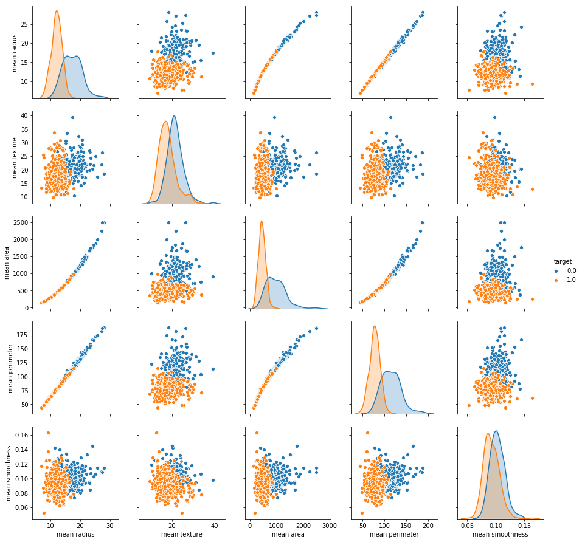
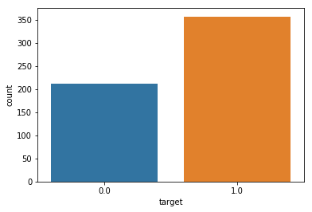
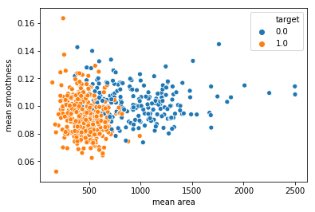
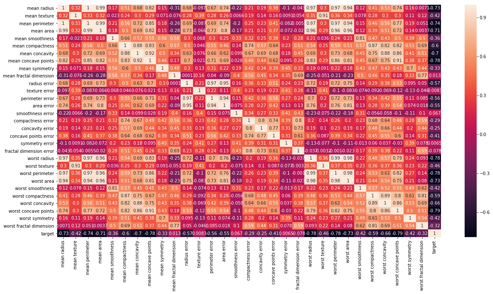
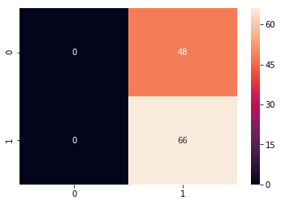
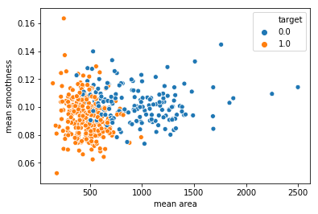
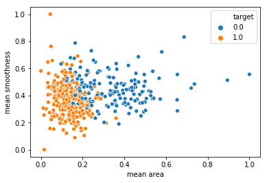
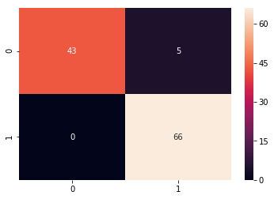
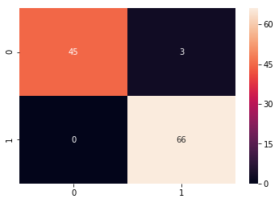

# BREAST CANCER CLASSIFICATION


# STEP #1: PROBLEM STATEMENT


- Predicting if the cancer diagnosis is benign or malignant based on several observations/features 
- 30 features are used, examples:
        - radius (mean of distances from center to points on the perimeter)
        - texture (standard deviation of gray-scale values)
        - perimeter
        - area
        - smoothness (local variation in radius lengths)
        - compactness (perimeter^2 / area - 1.0)
        - concavity (severity of concave portions of the contour)
        - concave points (number of concave portions of the contour)
        - symmetry 
        - fractal dimension ("coastline approximation" - 1)

- Datasets are linearly separable using all 30 input features
- Number of Instances: 569
- Class Distribution: 212 Malignant, 357 Benign
- Target class:
         - Malignant
         - Benign


https://archive.ics.uci.edu/ml/datasets/Breast+Cancer+Wisconsin+(Diagnostic)


# STEP #2: IMPORTING DATA


```python
# import libraries 
import pandas as pd # Import Pandas for data manipulation using dataframes
import numpy as np # Import Numpy for data statistical analysis 
import matplotlib.pyplot as plt # Import matplotlib for data visualisation
import seaborn as sns # Statistical data visualization
# %matplotlib inline
```


```python
# Import Cancer data drom the Sklearn library
from sklearn.datasets import load_breast_cancer
cancer = load_breast_cancer()
```


```python
cancer
```


    {'data': array([[1.799e+01, 1.038e+01, 1.228e+02, ..., 2.654e-01, 4.601e-01,
             1.189e-01],
            [2.057e+01, 1.777e+01, 1.329e+02, ..., 1.860e-01, 2.750e-01,
             8.902e-02],
            [1.969e+01, 2.125e+01, 1.300e+02, ..., 2.430e-01, 3.613e-01,
             8.758e-02],
            ...,
            [1.660e+01, 2.808e+01, 1.083e+02, ..., 1.418e-01, 2.218e-01,
             7.820e-02],
            [2.060e+01, 2.933e+01, 1.401e+02, ..., 2.650e-01, 4.087e-01,
             1.240e-01],
            [7.760e+00, 2.454e+01, 4.792e+01, ..., 0.000e+00, 2.871e-01,
             7.039e-02]]),
     'target': array([0, 0, 0, 0, 0, 0, 0, 0, 0, 0, 0, 0, 0, 0, 0, 0, 0, 0, 0, 1, 1, 1,
            0, 0, 0, 0, 0, 0, 0, 0, 0, 0, 0, 0, 0, 0, 0, 1, 0, 0, 0, 0, 0, 0,
            0, 0, 1, 0, 1, 1, 1, 1, 1, 0, 0, 1, 0, 0, 1, 1, 1, 1, 0, 1, 0, 0,
            1, 1, 1, 1, 0, 1, 0, 0, 1, 0, 1, 0, 0, 1, 1, 1, 0, 0, 1, 0, 0, 0,
            1, 1, 1, 0, 1, 1, 0, 0, 1, 1, 1, 0, 0, 1, 1, 1, 1, 0, 1, 1, 0, 1,
            1, 1, 1, 1, 1, 1, 1, 0, 0, 0, 1, 0, 0, 1, 1, 1, 0, 0, 1, 0, 1, 0,
            0, 1, 0, 0, 1, 1, 0, 1, 1, 0, 1, 1, 1, 1, 0, 1, 1, 1, 1, 1, 1, 1,
            1, 1, 0, 1, 1, 1, 1, 0, 0, 1, 0, 1, 1, 0, 0, 1, 1, 0, 0, 1, 1, 1,
            1, 0, 1, 1, 0, 0, 0, 1, 0, 1, 0, 1, 1, 1, 0, 1, 1, 0, 0, 1, 0, 0,
            0, 0, 1, 0, 0, 0, 1, 0, 1, 0, 1, 1, 0, 1, 0, 0, 0, 0, 1, 1, 0, 0,
            1, 1, 1, 0, 1, 1, 1, 1, 1, 0, 0, 1, 1, 0, 1, 1, 0, 0, 1, 0, 1, 1,
            1, 1, 0, 1, 1, 1, 1, 1, 0, 1, 0, 0, 0, 0, 0, 0, 0, 0, 0, 0, 0, 0,
            0, 0, 1, 1, 1, 1, 1, 1, 0, 1, 0, 1, 1, 0, 1, 1, 0, 1, 0, 0, 1, 1,
            1, 1, 1, 1, 1, 1, 1, 1, 1, 1, 1, 0, 1, 1, 0, 1, 0, 1, 1, 1, 1, 1,
            1, 1, 1, 1, 1, 1, 1, 1, 1, 0, 1, 1, 1, 0, 1, 0, 1, 1, 1, 1, 0, 0,
            0, 1, 1, 1, 1, 0, 1, 0, 1, 0, 1, 1, 1, 0, 1, 1, 1, 1, 1, 1, 1, 0,
            0, 0, 1, 1, 1, 1, 1, 1, 1, 1, 1, 1, 1, 0, 0, 1, 0, 0, 0, 1, 0, 0,
            1, 1, 1, 1, 1, 0, 1, 1, 1, 1, 1, 0, 1, 1, 1, 0, 1, 1, 0, 0, 1, 1,
            1, 1, 1, 1, 0, 1, 1, 1, 1, 1, 1, 1, 0, 1, 1, 1, 1, 1, 0, 1, 1, 0,
            1, 1, 1, 1, 1, 1, 1, 1, 1, 1, 1, 1, 0, 1, 0, 0, 1, 0, 1, 1, 1, 1,
            1, 0, 1, 1, 0, 1, 0, 1, 1, 0, 1, 0, 1, 1, 1, 1, 1, 1, 1, 1, 0, 0,
            1, 1, 1, 1, 1, 1, 0, 1, 1, 1, 1, 1, 1, 1, 1, 1, 1, 0, 1, 1, 1, 1,
            1, 1, 1, 0, 1, 0, 1, 1, 0, 1, 1, 1, 1, 1, 0, 0, 1, 0, 1, 0, 1, 1,
            1, 1, 1, 0, 1, 1, 0, 1, 0, 1, 0, 0, 1, 1, 1, 0, 1, 1, 1, 1, 1, 1,
            1, 1, 1, 1, 1, 0, 1, 0, 0, 1, 1, 1, 1, 1, 1, 1, 1, 1, 1, 1, 1, 1,
            1, 1, 1, 1, 1, 1, 1, 1, 1, 1, 1, 1, 0, 0, 0, 0, 0, 0, 1]),
     'target_names': array(['malignant', 'benign'], dtype='<U9'),
     'DESCR': 'Breast Cancer Wisconsin (Diagnostic) Database\n=============================================\n\nNotes\n-----\nData Set Characteristics:\n    :Number of Instances: 569\n\n    :Number of Attributes: 30 numeric, predictive attributes and the class\n\n    :Attribute Information:\n        - radius (mean of distances from center to points on the perimeter)\n        - texture (standard deviation of gray-scale values)\n        - perimeter\n        - area\n        - smoothness (local variation in radius lengths)\n        - compactness (perimeter^2 / area - 1.0)\n        - concavity (severity of concave portions of the contour)\n        - concave points (number of concave portions of the contour)\n        - symmetry \n        - fractal dimension ("coastline approximation" - 1)\n\n        The mean, standard error, and "worst" or largest (mean of the three\n        largest values) of these features were computed for each image,\n        resulting in 30 features.  For instance, field 3 is Mean Radius, field\n        13 is Radius SE, field 23 is Worst Radius.\n\n        - class:\n                - WDBC-Malignant\n                - WDBC-Benign\n\n    :Summary Statistics:\n\n    ===================================== ====== ======\n                                           Min    Max\n    ===================================== ====== ======\n    radius (mean):                        6.981  28.11\n    texture (mean):                       9.71   39.28\n    perimeter (mean):                     43.79  188.5\n    area (mean):                          143.5  2501.0\n    smoothness (mean):                    0.053  0.163\n    compactness (mean):                   0.019  0.345\n    concavity (mean):                     0.0    0.427\n    concave points (mean):                0.0    0.201\n    symmetry (mean):                      0.106  0.304\n    fractal dimension (mean):             0.05   0.097\n    radius (standard error):              0.112  2.873\n    texture (standard error):             0.36   4.885\n    perimeter (standard error):           0.757  21.98\n    area (standard error):                6.802  542.2\n    smoothness (standard error):          0.002  0.031\n    compactness (standard error):         0.002  0.135\n    concavity (standard error):           0.0    0.396\n    concave points (standard error):      0.0    0.053\n    symmetry (standard error):            0.008  0.079\n    fractal dimension (standard error):   0.001  0.03\n    radius (worst):                       7.93   36.04\n    texture (worst):                      12.02  49.54\n    perimeter (worst):                    50.41  251.2\n    area (worst):                         185.2  4254.0\n    smoothness (worst):                   0.071  0.223\n    compactness (worst):                  0.027  1.058\n    concavity (worst):                    0.0    1.252\n    concave points (worst):               0.0    0.291\n    symmetry (worst):                     0.156  0.664\n    fractal dimension (worst):            0.055  0.208\n    ===================================== ====== ======\n\n    :Missing Attribute Values: None\n\n    :Class Distribution: 212 - Malignant, 357 - Benign\n\n    :Creator:  Dr. William H. Wolberg, W. Nick Street, Olvi L. Mangasarian\n\n    :Donor: Nick Street\n\n    :Date: November, 1995\n\nThis is a copy of UCI ML Breast Cancer Wisconsin (Diagnostic) datasets.\nhttps://goo.gl/U2Uwz2\n\nFeatures are computed from a digitized image of a fine needle\naspirate (FNA) of a breast mass.  They describe\ncharacteristics of the cell nuclei present in the image.\n\nSeparating plane described above was obtained using\nMultisurface Method-Tree (MSM-T) [K. P. Bennett, "Decision Tree\nConstruction Via Linear Programming." Proceedings of the 4th\nMidwest Artificial Intelligence and Cognitive Science Society,\npp. 97-101, 1992], a classification method which uses linear\nprogramming to construct a decision tree.  Relevant features\nwere selected using an exhaustive search in the space of 1-4\nfeatures and 1-3 separating planes.\n\nThe actual linear program used to obtain the separating plane\nin the 3-dimensional space is that described in:\n[K. P. Bennett and O. L. Mangasarian: "Robust Linear\nProgramming Discrimination of Two Linearly Inseparable Sets",\nOptimization Methods and Software 1, 1992, 23-34].\n\nThis database is also available through the UW CS ftp server:\n\nftp ftp.cs.wisc.edu\ncd math-prog/cpo-dataset/machine-learn/WDBC/\n\nReferences\n----------\n   - W.N. Street, W.H. Wolberg and O.L. Mangasarian. Nuclear feature extraction \n     for breast tumor diagnosis. IS&T/SPIE 1993 International Symposium on \n     Electronic Imaging: Science and Technology, volume 1905, pages 861-870,\n     San Jose, CA, 1993.\n   - O.L. Mangasarian, W.N. Street and W.H. Wolberg. Breast cancer diagnosis and \n     prognosis via linear programming. Operations Research, 43(4), pages 570-577, \n     July-August 1995.\n   - W.H. Wolberg, W.N. Street, and O.L. Mangasarian. Machine learning techniques\n     to diagnose breast cancer from fine-needle aspirates. Cancer Letters 77 (1994) \n     163-171.\n',
     'feature_names': array(['mean radius', 'mean texture', 'mean perimeter', 'mean area',
            'mean smoothness', 'mean compactness', 'mean concavity',
            'mean concave points', 'mean symmetry', 'mean fractal dimension',
            'radius error', 'texture error', 'perimeter error', 'area error',
            'smoothness error', 'compactness error', 'concavity error',
            'concave points error', 'symmetry error',
            'fractal dimension error', 'worst radius', 'worst texture',
            'worst perimeter', 'worst area', 'worst smoothness',
            'worst compactness', 'worst concavity', 'worst concave points',
            'worst symmetry', 'worst fractal dimension'], dtype='<U23')}


```python
cancer.keys()
```


    dict_keys(['data', 'target', 'target_names', 'DESCR', 'feature_names'])


```python
print(cancer['DESCR'])
```

    Breast Cancer Wisconsin (Diagnostic) Database
    =============================================
    
    Notes
    -----
    Data Set Characteristics:
        :Number of Instances: 569
    
        :Number of Attributes: 30 numeric, predictive attributes and the class
    
        :Attribute Information:
            - radius (mean of distances from center to points on the perimeter)
            - texture (standard deviation of gray-scale values)
            - perimeter
            - area
            - smoothness (local variation in radius lengths)
            - compactness (perimeter^2 / area - 1.0)
            - concavity (severity of concave portions of the contour)
            - concave points (number of concave portions of the contour)
            - symmetry 
            - fractal dimension ("coastline approximation" - 1)
    
            The mean, standard error, and "worst" or largest (mean of the three
            largest values) of these features were computed for each image,
            resulting in 30 features.  For instance, field 3 is Mean Radius, field
            13 is Radius SE, field 23 is Worst Radius.
    
            - class:
                    - WDBC-Malignant
                    - WDBC-Benign
    
        :Summary Statistics:
    
        ===================================== ====== ======
                                               Min    Max
        ===================================== ====== ======
        radius (mean):                        6.981  28.11
        texture (mean):                       9.71   39.28
        perimeter (mean):                     43.79  188.5
        area (mean):                          143.5  2501.0
        smoothness (mean):                    0.053  0.163
        compactness (mean):                   0.019  0.345
        concavity (mean):                     0.0    0.427
        concave points (mean):                0.0    0.201
        symmetry (mean):                      0.106  0.304
        fractal dimension (mean):             0.05   0.097
        radius (standard error):              0.112  2.873
        texture (standard error):             0.36   4.885
        perimeter (standard error):           0.757  21.98
        area (standard error):                6.802  542.2
        smoothness (standard error):          0.002  0.031
        compactness (standard error):         0.002  0.135
        concavity (standard error):           0.0    0.396
        concave points (standard error):      0.0    0.053
        symmetry (standard error):            0.008  0.079
        fractal dimension (standard error):   0.001  0.03
        radius (worst):                       7.93   36.04
        texture (worst):                      12.02  49.54
        perimeter (worst):                    50.41  251.2
        area (worst):                         185.2  4254.0
        smoothness (worst):                   0.071  0.223
        compactness (worst):                  0.027  1.058
        concavity (worst):                    0.0    1.252
        concave points (worst):               0.0    0.291
        symmetry (worst):                     0.156  0.664
        fractal dimension (worst):            0.055  0.208
        ===================================== ====== ======
    
        :Missing Attribute Values: None
    
        :Class Distribution: 212 - Malignant, 357 - Benign
    
        :Creator:  Dr. William H. Wolberg, W. Nick Street, Olvi L. Mangasarian
    
        :Donor: Nick Street
    
        :Date: November, 1995
    
    This is a copy of UCI ML Breast Cancer Wisconsin (Diagnostic) datasets.
    https://goo.gl/U2Uwz2
    
    Features are computed from a digitized image of a fine needle
    aspirate (FNA) of a breast mass.  They describe
    characteristics of the cell nuclei present in the image.
    
    Separating plane described above was obtained using
    Multisurface Method-Tree (MSM-T) [K. P. Bennett, "Decision Tree
    Construction Via Linear Programming." Proceedings of the 4th
    Midwest Artificial Intelligence and Cognitive Science Society,
    pp. 97-101, 1992], a classification method which uses linear
    programming to construct a decision tree.  Relevant features
    were selected using an exhaustive search in the space of 1-4
    features and 1-3 separating planes.
    
    The actual linear program used to obtain the separating plane
    in the 3-dimensional space is that described in:
    [K. P. Bennett and O. L. Mangasarian: "Robust Linear
    Programming Discrimination of Two Linearly Inseparable Sets",
    Optimization Methods and Software 1, 1992, 23-34].
    
    This database is also available through the UW CS ftp server:
    
    ftp ftp.cs.wisc.edu
    cd math-prog/cpo-dataset/machine-learn/WDBC/
    
    References
    ----------
       - W.N. Street, W.H. Wolberg and O.L. Mangasarian. Nuclear feature extraction 
         for breast tumor diagnosis. IS&T/SPIE 1993 International Symposium on 
         Electronic Imaging: Science and Technology, volume 1905, pages 861-870,
         San Jose, CA, 1993.
       - O.L. Mangasarian, W.N. Street and W.H. Wolberg. Breast cancer diagnosis and 
         prognosis via linear programming. Operations Research, 43(4), pages 570-577, 
         July-August 1995.
       - W.H. Wolberg, W.N. Street, and O.L. Mangasarian. Machine learning techniques
         to diagnose breast cancer from fine-needle aspirates. Cancer Letters 77 (1994) 
         163-171.
    


```python
print(cancer['target_names'])
```

    ['malignant' 'benign']


```python
print(cancer['target'])
```

    [0 0 0 0 0 0 0 0 0 0 0 0 0 0 0 0 0 0 0 1 1 1 0 0 0 0 0 0 0 0 0 0 0 0 0 0 0
     1 0 0 0 0 0 0 0 0 1 0 1 1 1 1 1 0 0 1 0 0 1 1 1 1 0 1 0 0 1 1 1 1 0 1 0 0
     1 0 1 0 0 1 1 1 0 0 1 0 0 0 1 1 1 0 1 1 0 0 1 1 1 0 0 1 1 1 1 0 1 1 0 1 1
     1 1 1 1 1 1 0 0 0 1 0 0 1 1 1 0 0 1 0 1 0 0 1 0 0 1 1 0 1 1 0 1 1 1 1 0 1
     1 1 1 1 1 1 1 1 0 1 1 1 1 0 0 1 0 1 1 0 0 1 1 0 0 1 1 1 1 0 1 1 0 0 0 1 0
     1 0 1 1 1 0 1 1 0 0 1 0 0 0 0 1 0 0 0 1 0 1 0 1 1 0 1 0 0 0 0 1 1 0 0 1 1
     1 0 1 1 1 1 1 0 0 1 1 0 1 1 0 0 1 0 1 1 1 1 0 1 1 1 1 1 0 1 0 0 0 0 0 0 0
     0 0 0 0 0 0 0 1 1 1 1 1 1 0 1 0 1 1 0 1 1 0 1 0 0 1 1 1 1 1 1 1 1 1 1 1 1
     1 0 1 1 0 1 0 1 1 1 1 1 1 1 1 1 1 1 1 1 1 0 1 1 1 0 1 0 1 1 1 1 0 0 0 1 1
     1 1 0 1 0 1 0 1 1 1 0 1 1 1 1 1 1 1 0 0 0 1 1 1 1 1 1 1 1 1 1 1 0 0 1 0 0
     0 1 0 0 1 1 1 1 1 0 1 1 1 1 1 0 1 1 1 0 1 1 0 0 1 1 1 1 1 1 0 1 1 1 1 1 1
     1 0 1 1 1 1 1 0 1 1 0 1 1 1 1 1 1 1 1 1 1 1 1 0 1 0 0 1 0 1 1 1 1 1 0 1 1
     0 1 0 1 1 0 1 0 1 1 1 1 1 1 1 1 0 0 1 1 1 1 1 1 0 1 1 1 1 1 1 1 1 1 1 0 1
     1 1 1 1 1 1 0 1 0 1 1 0 1 1 1 1 1 0 0 1 0 1 0 1 1 1 1 1 0 1 1 0 1 0 1 0 0
     1 1 1 0 1 1 1 1 1 1 1 1 1 1 1 0 1 0 0 1 1 1 1 1 1 1 1 1 1 1 1 1 1 1 1 1 1
     1 1 1 1 1 1 1 0 0 0 0 0 0 1]


```python
print(cancer['feature_names'])
```

    ['mean radius' 'mean texture' 'mean perimeter' 'mean area'
     'mean smoothness' 'mean compactness' 'mean concavity'
     'mean concave points' 'mean symmetry' 'mean fractal dimension'
     'radius error' 'texture error' 'perimeter error' 'area error'
     'smoothness error' 'compactness error' 'concavity error'
     'concave points error' 'symmetry error' 'fractal dimension error'
     'worst radius' 'worst texture' 'worst perimeter' 'worst area'
     'worst smoothness' 'worst compactness' 'worst concavity'
     'worst concave points' 'worst symmetry' 'worst fractal dimension']


```python
print(cancer['data'])

```

    [[1.799e+01 1.038e+01 1.228e+02 ... 2.654e-01 4.601e-01 1.189e-01]
     [2.057e+01 1.777e+01 1.329e+02 ... 1.860e-01 2.750e-01 8.902e-02]
     [1.969e+01 2.125e+01 1.300e+02 ... 2.430e-01 3.613e-01 8.758e-02]
     ...
     [1.660e+01 2.808e+01 1.083e+02 ... 1.418e-01 2.218e-01 7.820e-02]
     [2.060e+01 2.933e+01 1.401e+02 ... 2.650e-01 4.087e-01 1.240e-01]
     [7.760e+00 2.454e+01 4.792e+01 ... 0.000e+00 2.871e-01 7.039e-02]]


```python
cancer['data'].shape
```


    (569, 30)


```python
df_cancer = pd.DataFrame(np.c_[cancer['data'], cancer['target']], columns = np.append(cancer['feature_names'], ['target']))

```


```python
df_cancer.head()
```


<div>
<style scoped>
    .dataframe tbody tr th:only-of-type {
        vertical-align: middle;
    }

    .dataframe tbody tr th {
        vertical-align: top;
    }

    .dataframe thead th {
        text-align: right;
    }
</style>
<table border="1" class="dataframe">
  <thead>
    <tr style="text-align: right;">
      <th></th>
      <th>mean radius</th>
      <th>mean texture</th>
      <th>mean perimeter</th>
      <th>mean area</th>
      <th>mean smoothness</th>
      <th>mean compactness</th>
      <th>mean concavity</th>
      <th>mean concave points</th>
      <th>mean symmetry</th>
      <th>mean fractal dimension</th>
      <th>...</th>
      <th>worst texture</th>
      <th>worst perimeter</th>
      <th>worst area</th>
      <th>worst smoothness</th>
      <th>worst compactness</th>
      <th>worst concavity</th>
      <th>worst concave points</th>
      <th>worst symmetry</th>
      <th>worst fractal dimension</th>
      <th>target</th>
    </tr>
  </thead>
  <tbody>
    <tr>
      <th>0</th>
      <td>17.99</td>
      <td>10.38</td>
      <td>122.80</td>
      <td>1001.0</td>
      <td>0.11840</td>
      <td>0.27760</td>
      <td>0.3001</td>
      <td>0.14710</td>
      <td>0.2419</td>
      <td>0.07871</td>
      <td>...</td>
      <td>17.33</td>
      <td>184.60</td>
      <td>2019.0</td>
      <td>0.1622</td>
      <td>0.6656</td>
      <td>0.7119</td>
      <td>0.2654</td>
      <td>0.4601</td>
      <td>0.11890</td>
      <td>0.0</td>
    </tr>
    <tr>
      <th>1</th>
      <td>20.57</td>
      <td>17.77</td>
      <td>132.90</td>
      <td>1326.0</td>
      <td>0.08474</td>
      <td>0.07864</td>
      <td>0.0869</td>
      <td>0.07017</td>
      <td>0.1812</td>
      <td>0.05667</td>
      <td>...</td>
      <td>23.41</td>
      <td>158.80</td>
      <td>1956.0</td>
      <td>0.1238</td>
      <td>0.1866</td>
      <td>0.2416</td>
      <td>0.1860</td>
      <td>0.2750</td>
      <td>0.08902</td>
      <td>0.0</td>
    </tr>
    <tr>
      <th>2</th>
      <td>19.69</td>
      <td>21.25</td>
      <td>130.00</td>
      <td>1203.0</td>
      <td>0.10960</td>
      <td>0.15990</td>
      <td>0.1974</td>
      <td>0.12790</td>
      <td>0.2069</td>
      <td>0.05999</td>
      <td>...</td>
      <td>25.53</td>
      <td>152.50</td>
      <td>1709.0</td>
      <td>0.1444</td>
      <td>0.4245</td>
      <td>0.4504</td>
      <td>0.2430</td>
      <td>0.3613</td>
      <td>0.08758</td>
      <td>0.0</td>
    </tr>
    <tr>
      <th>3</th>
      <td>11.42</td>
      <td>20.38</td>
      <td>77.58</td>
      <td>386.1</td>
      <td>0.14250</td>
      <td>0.28390</td>
      <td>0.2414</td>
      <td>0.10520</td>
      <td>0.2597</td>
      <td>0.09744</td>
      <td>...</td>
      <td>26.50</td>
      <td>98.87</td>
      <td>567.7</td>
      <td>0.2098</td>
      <td>0.8663</td>
      <td>0.6869</td>
      <td>0.2575</td>
      <td>0.6638</td>
      <td>0.17300</td>
      <td>0.0</td>
    </tr>
    <tr>
      <th>4</th>
      <td>20.29</td>
      <td>14.34</td>
      <td>135.10</td>
      <td>1297.0</td>
      <td>0.10030</td>
      <td>0.13280</td>
      <td>0.1980</td>
      <td>0.10430</td>
      <td>0.1809</td>
      <td>0.05883</td>
      <td>...</td>
      <td>16.67</td>
      <td>152.20</td>
      <td>1575.0</td>
      <td>0.1374</td>
      <td>0.2050</td>
      <td>0.4000</td>
      <td>0.1625</td>
      <td>0.2364</td>
      <td>0.07678</td>
      <td>0.0</td>
    </tr>
  </tbody>
</table>
<p>5 rows × 31 columns</p>
</div>


```python
df_cancer.tail()
```


<div>
<style scoped>
    .dataframe tbody tr th:only-of-type {
        vertical-align: middle;
    }

    .dataframe tbody tr th {
        vertical-align: top;
    }

    .dataframe thead th {
        text-align: right;
    }
</style>
<table border="1" class="dataframe">
  <thead>
    <tr style="text-align: right;">
      <th></th>
      <th>mean radius</th>
      <th>mean texture</th>
      <th>mean perimeter</th>
      <th>mean area</th>
      <th>mean smoothness</th>
      <th>mean compactness</th>
      <th>mean concavity</th>
      <th>mean concave points</th>
      <th>mean symmetry</th>
      <th>mean fractal dimension</th>
      <th>...</th>
      <th>worst texture</th>
      <th>worst perimeter</th>
      <th>worst area</th>
      <th>worst smoothness</th>
      <th>worst compactness</th>
      <th>worst concavity</th>
      <th>worst concave points</th>
      <th>worst symmetry</th>
      <th>worst fractal dimension</th>
      <th>target</th>
    </tr>
  </thead>
  <tbody>
    <tr>
      <th>564</th>
      <td>21.56</td>
      <td>22.39</td>
      <td>142.00</td>
      <td>1479.0</td>
      <td>0.11100</td>
      <td>0.11590</td>
      <td>0.24390</td>
      <td>0.13890</td>
      <td>0.1726</td>
      <td>0.05623</td>
      <td>...</td>
      <td>26.40</td>
      <td>166.10</td>
      <td>2027.0</td>
      <td>0.14100</td>
      <td>0.21130</td>
      <td>0.4107</td>
      <td>0.2216</td>
      <td>0.2060</td>
      <td>0.07115</td>
      <td>0.0</td>
    </tr>
    <tr>
      <th>565</th>
      <td>20.13</td>
      <td>28.25</td>
      <td>131.20</td>
      <td>1261.0</td>
      <td>0.09780</td>
      <td>0.10340</td>
      <td>0.14400</td>
      <td>0.09791</td>
      <td>0.1752</td>
      <td>0.05533</td>
      <td>...</td>
      <td>38.25</td>
      <td>155.00</td>
      <td>1731.0</td>
      <td>0.11660</td>
      <td>0.19220</td>
      <td>0.3215</td>
      <td>0.1628</td>
      <td>0.2572</td>
      <td>0.06637</td>
      <td>0.0</td>
    </tr>
    <tr>
      <th>566</th>
      <td>16.60</td>
      <td>28.08</td>
      <td>108.30</td>
      <td>858.1</td>
      <td>0.08455</td>
      <td>0.10230</td>
      <td>0.09251</td>
      <td>0.05302</td>
      <td>0.1590</td>
      <td>0.05648</td>
      <td>...</td>
      <td>34.12</td>
      <td>126.70</td>
      <td>1124.0</td>
      <td>0.11390</td>
      <td>0.30940</td>
      <td>0.3403</td>
      <td>0.1418</td>
      <td>0.2218</td>
      <td>0.07820</td>
      <td>0.0</td>
    </tr>
    <tr>
      <th>567</th>
      <td>20.60</td>
      <td>29.33</td>
      <td>140.10</td>
      <td>1265.0</td>
      <td>0.11780</td>
      <td>0.27700</td>
      <td>0.35140</td>
      <td>0.15200</td>
      <td>0.2397</td>
      <td>0.07016</td>
      <td>...</td>
      <td>39.42</td>
      <td>184.60</td>
      <td>1821.0</td>
      <td>0.16500</td>
      <td>0.86810</td>
      <td>0.9387</td>
      <td>0.2650</td>
      <td>0.4087</td>
      <td>0.12400</td>
      <td>0.0</td>
    </tr>
    <tr>
      <th>568</th>
      <td>7.76</td>
      <td>24.54</td>
      <td>47.92</td>
      <td>181.0</td>
      <td>0.05263</td>
      <td>0.04362</td>
      <td>0.00000</td>
      <td>0.00000</td>
      <td>0.1587</td>
      <td>0.05884</td>
      <td>...</td>
      <td>30.37</td>
      <td>59.16</td>
      <td>268.6</td>
      <td>0.08996</td>
      <td>0.06444</td>
      <td>0.0000</td>
      <td>0.0000</td>
      <td>0.2871</td>
      <td>0.07039</td>
      <td>1.0</td>
    </tr>
  </tbody>
</table>
<p>5 rows × 31 columns</p>
</div>


```python
x = np.array([1,2,3])
x.shape
```


    (3,)


```python
Example = np.c_[np.array([1,2,3]), np.array([4,5,6])]
Example.shape
```


    (3, 2)


# STEP #3: VISUALIZING THE DATA


```python
sns.pairplot(df_cancer, hue = 'target', vars = ['mean radius', 'mean texture', 'mean area', 'mean perimeter', 'mean smoothness'] )
```


    <seaborn.axisgrid.PairGrid at 0x1c93d061b00>





```python
sns.countplot(df_cancer['target'], label = "Count") 
```


    <matplotlib.axes._subplots.AxesSubplot at 0x1c93eebdeb8>





```python
sns.scatterplot(x = 'mean area', y = 'mean smoothness', hue = 'target', data = df_cancer)

```


    <matplotlib.axes._subplots.AxesSubplot at 0x1c93ef31ac8>





```python
#sns.lmplot('mean area', 'mean smoothness', hue ='target', data = df_cancer_all, fit_reg=False)
```


```python
# Let's check the correlation between the variables 
# Strong correlation between the mean radius and mean perimeter, mean area and mean primeter
plt.figure(figsize=(20,10)) 
sns.heatmap(df_cancer.corr(), annot=True) 
```


    <matplotlib.axes._subplots.AxesSubplot at 0x1c93f754940>





# STEP #4: MODEL TRAINING (FINDING A PROBLEM SOLUTION)


```python

# Let's drop the target label coloumns
X = df_cancer.drop(['target'],axis=1)

```


```python
X
```


<div>
<style scoped>
    .dataframe tbody tr th:only-of-type {
        vertical-align: middle;
    }

    .dataframe tbody tr th {
        vertical-align: top;
    }

    .dataframe thead th {
        text-align: right;
    }
</style>
<table border="1" class="dataframe">
  <thead>
    <tr style="text-align: right;">
      <th></th>
      <th>mean radius</th>
      <th>mean texture</th>
      <th>mean perimeter</th>
      <th>mean area</th>
      <th>mean smoothness</th>
      <th>mean compactness</th>
      <th>mean concavity</th>
      <th>mean concave points</th>
      <th>mean symmetry</th>
      <th>mean fractal dimension</th>
      <th>...</th>
      <th>worst radius</th>
      <th>worst texture</th>
      <th>worst perimeter</th>
      <th>worst area</th>
      <th>worst smoothness</th>
      <th>worst compactness</th>
      <th>worst concavity</th>
      <th>worst concave points</th>
      <th>worst symmetry</th>
      <th>worst fractal dimension</th>
    </tr>
  </thead>
  <tbody>
    <tr>
      <th>0</th>
      <td>17.990</td>
      <td>10.38</td>
      <td>122.80</td>
      <td>1001.0</td>
      <td>0.11840</td>
      <td>0.27760</td>
      <td>0.300100</td>
      <td>0.147100</td>
      <td>0.2419</td>
      <td>0.07871</td>
      <td>...</td>
      <td>25.380</td>
      <td>17.33</td>
      <td>184.60</td>
      <td>2019.0</td>
      <td>0.16220</td>
      <td>0.66560</td>
      <td>0.71190</td>
      <td>0.26540</td>
      <td>0.4601</td>
      <td>0.11890</td>
    </tr>
    <tr>
      <th>1</th>
      <td>20.570</td>
      <td>17.77</td>
      <td>132.90</td>
      <td>1326.0</td>
      <td>0.08474</td>
      <td>0.07864</td>
      <td>0.086900</td>
      <td>0.070170</td>
      <td>0.1812</td>
      <td>0.05667</td>
      <td>...</td>
      <td>24.990</td>
      <td>23.41</td>
      <td>158.80</td>
      <td>1956.0</td>
      <td>0.12380</td>
      <td>0.18660</td>
      <td>0.24160</td>
      <td>0.18600</td>
      <td>0.2750</td>
      <td>0.08902</td>
    </tr>
    <tr>
      <th>2</th>
      <td>19.690</td>
      <td>21.25</td>
      <td>130.00</td>
      <td>1203.0</td>
      <td>0.10960</td>
      <td>0.15990</td>
      <td>0.197400</td>
      <td>0.127900</td>
      <td>0.2069</td>
      <td>0.05999</td>
      <td>...</td>
      <td>23.570</td>
      <td>25.53</td>
      <td>152.50</td>
      <td>1709.0</td>
      <td>0.14440</td>
      <td>0.42450</td>
      <td>0.45040</td>
      <td>0.24300</td>
      <td>0.3613</td>
      <td>0.08758</td>
    </tr>
    <tr>
      <th>3</th>
      <td>11.420</td>
      <td>20.38</td>
      <td>77.58</td>
      <td>386.1</td>
      <td>0.14250</td>
      <td>0.28390</td>
      <td>0.241400</td>
      <td>0.105200</td>
      <td>0.2597</td>
      <td>0.09744</td>
      <td>...</td>
      <td>14.910</td>
      <td>26.50</td>
      <td>98.87</td>
      <td>567.7</td>
      <td>0.20980</td>
      <td>0.86630</td>
      <td>0.68690</td>
      <td>0.25750</td>
      <td>0.6638</td>
      <td>0.17300</td>
    </tr>
    <tr>
      <th>4</th>
      <td>20.290</td>
      <td>14.34</td>
      <td>135.10</td>
      <td>1297.0</td>
      <td>0.10030</td>
      <td>0.13280</td>
      <td>0.198000</td>
      <td>0.104300</td>
      <td>0.1809</td>
      <td>0.05883</td>
      <td>...</td>
      <td>22.540</td>
      <td>16.67</td>
      <td>152.20</td>
      <td>1575.0</td>
      <td>0.13740</td>
      <td>0.20500</td>
      <td>0.40000</td>
      <td>0.16250</td>
      <td>0.2364</td>
      <td>0.07678</td>
    </tr>
    <tr>
      <th>5</th>
      <td>12.450</td>
      <td>15.70</td>
      <td>82.57</td>
      <td>477.1</td>
      <td>0.12780</td>
      <td>0.17000</td>
      <td>0.157800</td>
      <td>0.080890</td>
      <td>0.2087</td>
      <td>0.07613</td>
      <td>...</td>
      <td>15.470</td>
      <td>23.75</td>
      <td>103.40</td>
      <td>741.6</td>
      <td>0.17910</td>
      <td>0.52490</td>
      <td>0.53550</td>
      <td>0.17410</td>
      <td>0.3985</td>
      <td>0.12440</td>
    </tr>
    <tr>
      <th>6</th>
      <td>18.250</td>
      <td>19.98</td>
      <td>119.60</td>
      <td>1040.0</td>
      <td>0.09463</td>
      <td>0.10900</td>
      <td>0.112700</td>
      <td>0.074000</td>
      <td>0.1794</td>
      <td>0.05742</td>
      <td>...</td>
      <td>22.880</td>
      <td>27.66</td>
      <td>153.20</td>
      <td>1606.0</td>
      <td>0.14420</td>
      <td>0.25760</td>
      <td>0.37840</td>
      <td>0.19320</td>
      <td>0.3063</td>
      <td>0.08368</td>
    </tr>
    <tr>
      <th>7</th>
      <td>13.710</td>
      <td>20.83</td>
      <td>90.20</td>
      <td>577.9</td>
      <td>0.11890</td>
      <td>0.16450</td>
      <td>0.093660</td>
      <td>0.059850</td>
      <td>0.2196</td>
      <td>0.07451</td>
      <td>...</td>
      <td>17.060</td>
      <td>28.14</td>
      <td>110.60</td>
      <td>897.0</td>
      <td>0.16540</td>
      <td>0.36820</td>
      <td>0.26780</td>
      <td>0.15560</td>
      <td>0.3196</td>
      <td>0.11510</td>
    </tr>
    <tr>
      <th>8</th>
      <td>13.000</td>
      <td>21.82</td>
      <td>87.50</td>
      <td>519.8</td>
      <td>0.12730</td>
      <td>0.19320</td>
      <td>0.185900</td>
      <td>0.093530</td>
      <td>0.2350</td>
      <td>0.07389</td>
      <td>...</td>
      <td>15.490</td>
      <td>30.73</td>
      <td>106.20</td>
      <td>739.3</td>
      <td>0.17030</td>
      <td>0.54010</td>
      <td>0.53900</td>
      <td>0.20600</td>
      <td>0.4378</td>
      <td>0.10720</td>
    </tr>
    <tr>
      <th>9</th>
      <td>12.460</td>
      <td>24.04</td>
      <td>83.97</td>
      <td>475.9</td>
      <td>0.11860</td>
      <td>0.23960</td>
      <td>0.227300</td>
      <td>0.085430</td>
      <td>0.2030</td>
      <td>0.08243</td>
      <td>...</td>
      <td>15.090</td>
      <td>40.68</td>
      <td>97.65</td>
      <td>711.4</td>
      <td>0.18530</td>
      <td>1.05800</td>
      <td>1.10500</td>
      <td>0.22100</td>
      <td>0.4366</td>
      <td>0.20750</td>
    </tr>
    <tr>
      <th>10</th>
      <td>16.020</td>
      <td>23.24</td>
      <td>102.70</td>
      <td>797.8</td>
      <td>0.08206</td>
      <td>0.06669</td>
      <td>0.032990</td>
      <td>0.033230</td>
      <td>0.1528</td>
      <td>0.05697</td>
      <td>...</td>
      <td>19.190</td>
      <td>33.88</td>
      <td>123.80</td>
      <td>1150.0</td>
      <td>0.11810</td>
      <td>0.15510</td>
      <td>0.14590</td>
      <td>0.09975</td>
      <td>0.2948</td>
      <td>0.08452</td>
    </tr>
    <tr>
      <th>11</th>
      <td>15.780</td>
      <td>17.89</td>
      <td>103.60</td>
      <td>781.0</td>
      <td>0.09710</td>
      <td>0.12920</td>
      <td>0.099540</td>
      <td>0.066060</td>
      <td>0.1842</td>
      <td>0.06082</td>
      <td>...</td>
      <td>20.420</td>
      <td>27.28</td>
      <td>136.50</td>
      <td>1299.0</td>
      <td>0.13960</td>
      <td>0.56090</td>
      <td>0.39650</td>
      <td>0.18100</td>
      <td>0.3792</td>
      <td>0.10480</td>
    </tr>
    <tr>
      <th>12</th>
      <td>19.170</td>
      <td>24.80</td>
      <td>132.40</td>
      <td>1123.0</td>
      <td>0.09740</td>
      <td>0.24580</td>
      <td>0.206500</td>
      <td>0.111800</td>
      <td>0.2397</td>
      <td>0.07800</td>
      <td>...</td>
      <td>20.960</td>
      <td>29.94</td>
      <td>151.70</td>
      <td>1332.0</td>
      <td>0.10370</td>
      <td>0.39030</td>
      <td>0.36390</td>
      <td>0.17670</td>
      <td>0.3176</td>
      <td>0.10230</td>
    </tr>
    <tr>
      <th>13</th>
      <td>15.850</td>
      <td>23.95</td>
      <td>103.70</td>
      <td>782.7</td>
      <td>0.08401</td>
      <td>0.10020</td>
      <td>0.099380</td>
      <td>0.053640</td>
      <td>0.1847</td>
      <td>0.05338</td>
      <td>...</td>
      <td>16.840</td>
      <td>27.66</td>
      <td>112.00</td>
      <td>876.5</td>
      <td>0.11310</td>
      <td>0.19240</td>
      <td>0.23220</td>
      <td>0.11190</td>
      <td>0.2809</td>
      <td>0.06287</td>
    </tr>
    <tr>
      <th>14</th>
      <td>13.730</td>
      <td>22.61</td>
      <td>93.60</td>
      <td>578.3</td>
      <td>0.11310</td>
      <td>0.22930</td>
      <td>0.212800</td>
      <td>0.080250</td>
      <td>0.2069</td>
      <td>0.07682</td>
      <td>...</td>
      <td>15.030</td>
      <td>32.01</td>
      <td>108.80</td>
      <td>697.7</td>
      <td>0.16510</td>
      <td>0.77250</td>
      <td>0.69430</td>
      <td>0.22080</td>
      <td>0.3596</td>
      <td>0.14310</td>
    </tr>
    <tr>
      <th>15</th>
      <td>14.540</td>
      <td>27.54</td>
      <td>96.73</td>
      <td>658.8</td>
      <td>0.11390</td>
      <td>0.15950</td>
      <td>0.163900</td>
      <td>0.073640</td>
      <td>0.2303</td>
      <td>0.07077</td>
      <td>...</td>
      <td>17.460</td>
      <td>37.13</td>
      <td>124.10</td>
      <td>943.2</td>
      <td>0.16780</td>
      <td>0.65770</td>
      <td>0.70260</td>
      <td>0.17120</td>
      <td>0.4218</td>
      <td>0.13410</td>
    </tr>
    <tr>
      <th>16</th>
      <td>14.680</td>
      <td>20.13</td>
      <td>94.74</td>
      <td>684.5</td>
      <td>0.09867</td>
      <td>0.07200</td>
      <td>0.073950</td>
      <td>0.052590</td>
      <td>0.1586</td>
      <td>0.05922</td>
      <td>...</td>
      <td>19.070</td>
      <td>30.88</td>
      <td>123.40</td>
      <td>1138.0</td>
      <td>0.14640</td>
      <td>0.18710</td>
      <td>0.29140</td>
      <td>0.16090</td>
      <td>0.3029</td>
      <td>0.08216</td>
    </tr>
    <tr>
      <th>17</th>
      <td>16.130</td>
      <td>20.68</td>
      <td>108.10</td>
      <td>798.8</td>
      <td>0.11700</td>
      <td>0.20220</td>
      <td>0.172200</td>
      <td>0.102800</td>
      <td>0.2164</td>
      <td>0.07356</td>
      <td>...</td>
      <td>20.960</td>
      <td>31.48</td>
      <td>136.80</td>
      <td>1315.0</td>
      <td>0.17890</td>
      <td>0.42330</td>
      <td>0.47840</td>
      <td>0.20730</td>
      <td>0.3706</td>
      <td>0.11420</td>
    </tr>
    <tr>
      <th>18</th>
      <td>19.810</td>
      <td>22.15</td>
      <td>130.00</td>
      <td>1260.0</td>
      <td>0.09831</td>
      <td>0.10270</td>
      <td>0.147900</td>
      <td>0.094980</td>
      <td>0.1582</td>
      <td>0.05395</td>
      <td>...</td>
      <td>27.320</td>
      <td>30.88</td>
      <td>186.80</td>
      <td>2398.0</td>
      <td>0.15120</td>
      <td>0.31500</td>
      <td>0.53720</td>
      <td>0.23880</td>
      <td>0.2768</td>
      <td>0.07615</td>
    </tr>
    <tr>
      <th>19</th>
      <td>13.540</td>
      <td>14.36</td>
      <td>87.46</td>
      <td>566.3</td>
      <td>0.09779</td>
      <td>0.08129</td>
      <td>0.066640</td>
      <td>0.047810</td>
      <td>0.1885</td>
      <td>0.05766</td>
      <td>...</td>
      <td>15.110</td>
      <td>19.26</td>
      <td>99.70</td>
      <td>711.2</td>
      <td>0.14400</td>
      <td>0.17730</td>
      <td>0.23900</td>
      <td>0.12880</td>
      <td>0.2977</td>
      <td>0.07259</td>
    </tr>
    <tr>
      <th>20</th>
      <td>13.080</td>
      <td>15.71</td>
      <td>85.63</td>
      <td>520.0</td>
      <td>0.10750</td>
      <td>0.12700</td>
      <td>0.045680</td>
      <td>0.031100</td>
      <td>0.1967</td>
      <td>0.06811</td>
      <td>...</td>
      <td>14.500</td>
      <td>20.49</td>
      <td>96.09</td>
      <td>630.5</td>
      <td>0.13120</td>
      <td>0.27760</td>
      <td>0.18900</td>
      <td>0.07283</td>
      <td>0.3184</td>
      <td>0.08183</td>
    </tr>
    <tr>
      <th>21</th>
      <td>9.504</td>
      <td>12.44</td>
      <td>60.34</td>
      <td>273.9</td>
      <td>0.10240</td>
      <td>0.06492</td>
      <td>0.029560</td>
      <td>0.020760</td>
      <td>0.1815</td>
      <td>0.06905</td>
      <td>...</td>
      <td>10.230</td>
      <td>15.66</td>
      <td>65.13</td>
      <td>314.9</td>
      <td>0.13240</td>
      <td>0.11480</td>
      <td>0.08867</td>
      <td>0.06227</td>
      <td>0.2450</td>
      <td>0.07773</td>
    </tr>
    <tr>
      <th>22</th>
      <td>15.340</td>
      <td>14.26</td>
      <td>102.50</td>
      <td>704.4</td>
      <td>0.10730</td>
      <td>0.21350</td>
      <td>0.207700</td>
      <td>0.097560</td>
      <td>0.2521</td>
      <td>0.07032</td>
      <td>...</td>
      <td>18.070</td>
      <td>19.08</td>
      <td>125.10</td>
      <td>980.9</td>
      <td>0.13900</td>
      <td>0.59540</td>
      <td>0.63050</td>
      <td>0.23930</td>
      <td>0.4667</td>
      <td>0.09946</td>
    </tr>
    <tr>
      <th>23</th>
      <td>21.160</td>
      <td>23.04</td>
      <td>137.20</td>
      <td>1404.0</td>
      <td>0.09428</td>
      <td>0.10220</td>
      <td>0.109700</td>
      <td>0.086320</td>
      <td>0.1769</td>
      <td>0.05278</td>
      <td>...</td>
      <td>29.170</td>
      <td>35.59</td>
      <td>188.00</td>
      <td>2615.0</td>
      <td>0.14010</td>
      <td>0.26000</td>
      <td>0.31550</td>
      <td>0.20090</td>
      <td>0.2822</td>
      <td>0.07526</td>
    </tr>
    <tr>
      <th>24</th>
      <td>16.650</td>
      <td>21.38</td>
      <td>110.00</td>
      <td>904.6</td>
      <td>0.11210</td>
      <td>0.14570</td>
      <td>0.152500</td>
      <td>0.091700</td>
      <td>0.1995</td>
      <td>0.06330</td>
      <td>...</td>
      <td>26.460</td>
      <td>31.56</td>
      <td>177.00</td>
      <td>2215.0</td>
      <td>0.18050</td>
      <td>0.35780</td>
      <td>0.46950</td>
      <td>0.20950</td>
      <td>0.3613</td>
      <td>0.09564</td>
    </tr>
    <tr>
      <th>25</th>
      <td>17.140</td>
      <td>16.40</td>
      <td>116.00</td>
      <td>912.7</td>
      <td>0.11860</td>
      <td>0.22760</td>
      <td>0.222900</td>
      <td>0.140100</td>
      <td>0.3040</td>
      <td>0.07413</td>
      <td>...</td>
      <td>22.250</td>
      <td>21.40</td>
      <td>152.40</td>
      <td>1461.0</td>
      <td>0.15450</td>
      <td>0.39490</td>
      <td>0.38530</td>
      <td>0.25500</td>
      <td>0.4066</td>
      <td>0.10590</td>
    </tr>
    <tr>
      <th>26</th>
      <td>14.580</td>
      <td>21.53</td>
      <td>97.41</td>
      <td>644.8</td>
      <td>0.10540</td>
      <td>0.18680</td>
      <td>0.142500</td>
      <td>0.087830</td>
      <td>0.2252</td>
      <td>0.06924</td>
      <td>...</td>
      <td>17.620</td>
      <td>33.21</td>
      <td>122.40</td>
      <td>896.9</td>
      <td>0.15250</td>
      <td>0.66430</td>
      <td>0.55390</td>
      <td>0.27010</td>
      <td>0.4264</td>
      <td>0.12750</td>
    </tr>
    <tr>
      <th>27</th>
      <td>18.610</td>
      <td>20.25</td>
      <td>122.10</td>
      <td>1094.0</td>
      <td>0.09440</td>
      <td>0.10660</td>
      <td>0.149000</td>
      <td>0.077310</td>
      <td>0.1697</td>
      <td>0.05699</td>
      <td>...</td>
      <td>21.310</td>
      <td>27.26</td>
      <td>139.90</td>
      <td>1403.0</td>
      <td>0.13380</td>
      <td>0.21170</td>
      <td>0.34460</td>
      <td>0.14900</td>
      <td>0.2341</td>
      <td>0.07421</td>
    </tr>
    <tr>
      <th>28</th>
      <td>15.300</td>
      <td>25.27</td>
      <td>102.40</td>
      <td>732.4</td>
      <td>0.10820</td>
      <td>0.16970</td>
      <td>0.168300</td>
      <td>0.087510</td>
      <td>0.1926</td>
      <td>0.06540</td>
      <td>...</td>
      <td>20.270</td>
      <td>36.71</td>
      <td>149.30</td>
      <td>1269.0</td>
      <td>0.16410</td>
      <td>0.61100</td>
      <td>0.63350</td>
      <td>0.20240</td>
      <td>0.4027</td>
      <td>0.09876</td>
    </tr>
    <tr>
      <th>29</th>
      <td>17.570</td>
      <td>15.05</td>
      <td>115.00</td>
      <td>955.1</td>
      <td>0.09847</td>
      <td>0.11570</td>
      <td>0.098750</td>
      <td>0.079530</td>
      <td>0.1739</td>
      <td>0.06149</td>
      <td>...</td>
      <td>20.010</td>
      <td>19.52</td>
      <td>134.90</td>
      <td>1227.0</td>
      <td>0.12550</td>
      <td>0.28120</td>
      <td>0.24890</td>
      <td>0.14560</td>
      <td>0.2756</td>
      <td>0.07919</td>
    </tr>
    <tr>
      <th>...</th>
      <td>...</td>
      <td>...</td>
      <td>...</td>
      <td>...</td>
      <td>...</td>
      <td>...</td>
      <td>...</td>
      <td>...</td>
      <td>...</td>
      <td>...</td>
      <td>...</td>
      <td>...</td>
      <td>...</td>
      <td>...</td>
      <td>...</td>
      <td>...</td>
      <td>...</td>
      <td>...</td>
      <td>...</td>
      <td>...</td>
      <td>...</td>
    </tr>
    <tr>
      <th>539</th>
      <td>7.691</td>
      <td>25.44</td>
      <td>48.34</td>
      <td>170.4</td>
      <td>0.08668</td>
      <td>0.11990</td>
      <td>0.092520</td>
      <td>0.013640</td>
      <td>0.2037</td>
      <td>0.07751</td>
      <td>...</td>
      <td>8.678</td>
      <td>31.89</td>
      <td>54.49</td>
      <td>223.6</td>
      <td>0.15960</td>
      <td>0.30640</td>
      <td>0.33930</td>
      <td>0.05000</td>
      <td>0.2790</td>
      <td>0.10660</td>
    </tr>
    <tr>
      <th>540</th>
      <td>11.540</td>
      <td>14.44</td>
      <td>74.65</td>
      <td>402.9</td>
      <td>0.09984</td>
      <td>0.11200</td>
      <td>0.067370</td>
      <td>0.025940</td>
      <td>0.1818</td>
      <td>0.06782</td>
      <td>...</td>
      <td>12.260</td>
      <td>19.68</td>
      <td>78.78</td>
      <td>457.8</td>
      <td>0.13450</td>
      <td>0.21180</td>
      <td>0.17970</td>
      <td>0.06918</td>
      <td>0.2329</td>
      <td>0.08134</td>
    </tr>
    <tr>
      <th>541</th>
      <td>14.470</td>
      <td>24.99</td>
      <td>95.81</td>
      <td>656.4</td>
      <td>0.08837</td>
      <td>0.12300</td>
      <td>0.100900</td>
      <td>0.038900</td>
      <td>0.1872</td>
      <td>0.06341</td>
      <td>...</td>
      <td>16.220</td>
      <td>31.73</td>
      <td>113.50</td>
      <td>808.9</td>
      <td>0.13400</td>
      <td>0.42020</td>
      <td>0.40400</td>
      <td>0.12050</td>
      <td>0.3187</td>
      <td>0.10230</td>
    </tr>
    <tr>
      <th>542</th>
      <td>14.740</td>
      <td>25.42</td>
      <td>94.70</td>
      <td>668.6</td>
      <td>0.08275</td>
      <td>0.07214</td>
      <td>0.041050</td>
      <td>0.030270</td>
      <td>0.1840</td>
      <td>0.05680</td>
      <td>...</td>
      <td>16.510</td>
      <td>32.29</td>
      <td>107.40</td>
      <td>826.4</td>
      <td>0.10600</td>
      <td>0.13760</td>
      <td>0.16110</td>
      <td>0.10950</td>
      <td>0.2722</td>
      <td>0.06956</td>
    </tr>
    <tr>
      <th>543</th>
      <td>13.210</td>
      <td>28.06</td>
      <td>84.88</td>
      <td>538.4</td>
      <td>0.08671</td>
      <td>0.06877</td>
      <td>0.029870</td>
      <td>0.032750</td>
      <td>0.1628</td>
      <td>0.05781</td>
      <td>...</td>
      <td>14.370</td>
      <td>37.17</td>
      <td>92.48</td>
      <td>629.6</td>
      <td>0.10720</td>
      <td>0.13810</td>
      <td>0.10620</td>
      <td>0.07958</td>
      <td>0.2473</td>
      <td>0.06443</td>
    </tr>
    <tr>
      <th>544</th>
      <td>13.870</td>
      <td>20.70</td>
      <td>89.77</td>
      <td>584.8</td>
      <td>0.09578</td>
      <td>0.10180</td>
      <td>0.036880</td>
      <td>0.023690</td>
      <td>0.1620</td>
      <td>0.06688</td>
      <td>...</td>
      <td>15.050</td>
      <td>24.75</td>
      <td>99.17</td>
      <td>688.6</td>
      <td>0.12640</td>
      <td>0.20370</td>
      <td>0.13770</td>
      <td>0.06845</td>
      <td>0.2249</td>
      <td>0.08492</td>
    </tr>
    <tr>
      <th>545</th>
      <td>13.620</td>
      <td>23.23</td>
      <td>87.19</td>
      <td>573.2</td>
      <td>0.09246</td>
      <td>0.06747</td>
      <td>0.029740</td>
      <td>0.024430</td>
      <td>0.1664</td>
      <td>0.05801</td>
      <td>...</td>
      <td>15.350</td>
      <td>29.09</td>
      <td>97.58</td>
      <td>729.8</td>
      <td>0.12160</td>
      <td>0.15170</td>
      <td>0.10490</td>
      <td>0.07174</td>
      <td>0.2642</td>
      <td>0.06953</td>
    </tr>
    <tr>
      <th>546</th>
      <td>10.320</td>
      <td>16.35</td>
      <td>65.31</td>
      <td>324.9</td>
      <td>0.09434</td>
      <td>0.04994</td>
      <td>0.010120</td>
      <td>0.005495</td>
      <td>0.1885</td>
      <td>0.06201</td>
      <td>...</td>
      <td>11.250</td>
      <td>21.77</td>
      <td>71.12</td>
      <td>384.9</td>
      <td>0.12850</td>
      <td>0.08842</td>
      <td>0.04384</td>
      <td>0.02381</td>
      <td>0.2681</td>
      <td>0.07399</td>
    </tr>
    <tr>
      <th>547</th>
      <td>10.260</td>
      <td>16.58</td>
      <td>65.85</td>
      <td>320.8</td>
      <td>0.08877</td>
      <td>0.08066</td>
      <td>0.043580</td>
      <td>0.024380</td>
      <td>0.1669</td>
      <td>0.06714</td>
      <td>...</td>
      <td>10.830</td>
      <td>22.04</td>
      <td>71.08</td>
      <td>357.4</td>
      <td>0.14610</td>
      <td>0.22460</td>
      <td>0.17830</td>
      <td>0.08333</td>
      <td>0.2691</td>
      <td>0.09479</td>
    </tr>
    <tr>
      <th>548</th>
      <td>9.683</td>
      <td>19.34</td>
      <td>61.05</td>
      <td>285.7</td>
      <td>0.08491</td>
      <td>0.05030</td>
      <td>0.023370</td>
      <td>0.009615</td>
      <td>0.1580</td>
      <td>0.06235</td>
      <td>...</td>
      <td>10.930</td>
      <td>25.59</td>
      <td>69.10</td>
      <td>364.2</td>
      <td>0.11990</td>
      <td>0.09546</td>
      <td>0.09350</td>
      <td>0.03846</td>
      <td>0.2552</td>
      <td>0.07920</td>
    </tr>
    <tr>
      <th>549</th>
      <td>10.820</td>
      <td>24.21</td>
      <td>68.89</td>
      <td>361.6</td>
      <td>0.08192</td>
      <td>0.06602</td>
      <td>0.015480</td>
      <td>0.008160</td>
      <td>0.1976</td>
      <td>0.06328</td>
      <td>...</td>
      <td>13.030</td>
      <td>31.45</td>
      <td>83.90</td>
      <td>505.6</td>
      <td>0.12040</td>
      <td>0.16330</td>
      <td>0.06194</td>
      <td>0.03264</td>
      <td>0.3059</td>
      <td>0.07626</td>
    </tr>
    <tr>
      <th>550</th>
      <td>10.860</td>
      <td>21.48</td>
      <td>68.51</td>
      <td>360.5</td>
      <td>0.07431</td>
      <td>0.04227</td>
      <td>0.000000</td>
      <td>0.000000</td>
      <td>0.1661</td>
      <td>0.05948</td>
      <td>...</td>
      <td>11.660</td>
      <td>24.77</td>
      <td>74.08</td>
      <td>412.3</td>
      <td>0.10010</td>
      <td>0.07348</td>
      <td>0.00000</td>
      <td>0.00000</td>
      <td>0.2458</td>
      <td>0.06592</td>
    </tr>
    <tr>
      <th>551</th>
      <td>11.130</td>
      <td>22.44</td>
      <td>71.49</td>
      <td>378.4</td>
      <td>0.09566</td>
      <td>0.08194</td>
      <td>0.048240</td>
      <td>0.022570</td>
      <td>0.2030</td>
      <td>0.06552</td>
      <td>...</td>
      <td>12.020</td>
      <td>28.26</td>
      <td>77.80</td>
      <td>436.6</td>
      <td>0.10870</td>
      <td>0.17820</td>
      <td>0.15640</td>
      <td>0.06413</td>
      <td>0.3169</td>
      <td>0.08032</td>
    </tr>
    <tr>
      <th>552</th>
      <td>12.770</td>
      <td>29.43</td>
      <td>81.35</td>
      <td>507.9</td>
      <td>0.08276</td>
      <td>0.04234</td>
      <td>0.019970</td>
      <td>0.014990</td>
      <td>0.1539</td>
      <td>0.05637</td>
      <td>...</td>
      <td>13.870</td>
      <td>36.00</td>
      <td>88.10</td>
      <td>594.7</td>
      <td>0.12340</td>
      <td>0.10640</td>
      <td>0.08653</td>
      <td>0.06498</td>
      <td>0.2407</td>
      <td>0.06484</td>
    </tr>
    <tr>
      <th>553</th>
      <td>9.333</td>
      <td>21.94</td>
      <td>59.01</td>
      <td>264.0</td>
      <td>0.09240</td>
      <td>0.05605</td>
      <td>0.039960</td>
      <td>0.012820</td>
      <td>0.1692</td>
      <td>0.06576</td>
      <td>...</td>
      <td>9.845</td>
      <td>25.05</td>
      <td>62.86</td>
      <td>295.8</td>
      <td>0.11030</td>
      <td>0.08298</td>
      <td>0.07993</td>
      <td>0.02564</td>
      <td>0.2435</td>
      <td>0.07393</td>
    </tr>
    <tr>
      <th>554</th>
      <td>12.880</td>
      <td>28.92</td>
      <td>82.50</td>
      <td>514.3</td>
      <td>0.08123</td>
      <td>0.05824</td>
      <td>0.061950</td>
      <td>0.023430</td>
      <td>0.1566</td>
      <td>0.05708</td>
      <td>...</td>
      <td>13.890</td>
      <td>35.74</td>
      <td>88.84</td>
      <td>595.7</td>
      <td>0.12270</td>
      <td>0.16200</td>
      <td>0.24390</td>
      <td>0.06493</td>
      <td>0.2372</td>
      <td>0.07242</td>
    </tr>
    <tr>
      <th>555</th>
      <td>10.290</td>
      <td>27.61</td>
      <td>65.67</td>
      <td>321.4</td>
      <td>0.09030</td>
      <td>0.07658</td>
      <td>0.059990</td>
      <td>0.027380</td>
      <td>0.1593</td>
      <td>0.06127</td>
      <td>...</td>
      <td>10.840</td>
      <td>34.91</td>
      <td>69.57</td>
      <td>357.6</td>
      <td>0.13840</td>
      <td>0.17100</td>
      <td>0.20000</td>
      <td>0.09127</td>
      <td>0.2226</td>
      <td>0.08283</td>
    </tr>
    <tr>
      <th>556</th>
      <td>10.160</td>
      <td>19.59</td>
      <td>64.73</td>
      <td>311.7</td>
      <td>0.10030</td>
      <td>0.07504</td>
      <td>0.005025</td>
      <td>0.011160</td>
      <td>0.1791</td>
      <td>0.06331</td>
      <td>...</td>
      <td>10.650</td>
      <td>22.88</td>
      <td>67.88</td>
      <td>347.3</td>
      <td>0.12650</td>
      <td>0.12000</td>
      <td>0.01005</td>
      <td>0.02232</td>
      <td>0.2262</td>
      <td>0.06742</td>
    </tr>
    <tr>
      <th>557</th>
      <td>9.423</td>
      <td>27.88</td>
      <td>59.26</td>
      <td>271.3</td>
      <td>0.08123</td>
      <td>0.04971</td>
      <td>0.000000</td>
      <td>0.000000</td>
      <td>0.1742</td>
      <td>0.06059</td>
      <td>...</td>
      <td>10.490</td>
      <td>34.24</td>
      <td>66.50</td>
      <td>330.6</td>
      <td>0.10730</td>
      <td>0.07158</td>
      <td>0.00000</td>
      <td>0.00000</td>
      <td>0.2475</td>
      <td>0.06969</td>
    </tr>
    <tr>
      <th>558</th>
      <td>14.590</td>
      <td>22.68</td>
      <td>96.39</td>
      <td>657.1</td>
      <td>0.08473</td>
      <td>0.13300</td>
      <td>0.102900</td>
      <td>0.037360</td>
      <td>0.1454</td>
      <td>0.06147</td>
      <td>...</td>
      <td>15.480</td>
      <td>27.27</td>
      <td>105.90</td>
      <td>733.5</td>
      <td>0.10260</td>
      <td>0.31710</td>
      <td>0.36620</td>
      <td>0.11050</td>
      <td>0.2258</td>
      <td>0.08004</td>
    </tr>
    <tr>
      <th>559</th>
      <td>11.510</td>
      <td>23.93</td>
      <td>74.52</td>
      <td>403.5</td>
      <td>0.09261</td>
      <td>0.10210</td>
      <td>0.111200</td>
      <td>0.041050</td>
      <td>0.1388</td>
      <td>0.06570</td>
      <td>...</td>
      <td>12.480</td>
      <td>37.16</td>
      <td>82.28</td>
      <td>474.2</td>
      <td>0.12980</td>
      <td>0.25170</td>
      <td>0.36300</td>
      <td>0.09653</td>
      <td>0.2112</td>
      <td>0.08732</td>
    </tr>
    <tr>
      <th>560</th>
      <td>14.050</td>
      <td>27.15</td>
      <td>91.38</td>
      <td>600.4</td>
      <td>0.09929</td>
      <td>0.11260</td>
      <td>0.044620</td>
      <td>0.043040</td>
      <td>0.1537</td>
      <td>0.06171</td>
      <td>...</td>
      <td>15.300</td>
      <td>33.17</td>
      <td>100.20</td>
      <td>706.7</td>
      <td>0.12410</td>
      <td>0.22640</td>
      <td>0.13260</td>
      <td>0.10480</td>
      <td>0.2250</td>
      <td>0.08321</td>
    </tr>
    <tr>
      <th>561</th>
      <td>11.200</td>
      <td>29.37</td>
      <td>70.67</td>
      <td>386.0</td>
      <td>0.07449</td>
      <td>0.03558</td>
      <td>0.000000</td>
      <td>0.000000</td>
      <td>0.1060</td>
      <td>0.05502</td>
      <td>...</td>
      <td>11.920</td>
      <td>38.30</td>
      <td>75.19</td>
      <td>439.6</td>
      <td>0.09267</td>
      <td>0.05494</td>
      <td>0.00000</td>
      <td>0.00000</td>
      <td>0.1566</td>
      <td>0.05905</td>
    </tr>
    <tr>
      <th>562</th>
      <td>15.220</td>
      <td>30.62</td>
      <td>103.40</td>
      <td>716.9</td>
      <td>0.10480</td>
      <td>0.20870</td>
      <td>0.255000</td>
      <td>0.094290</td>
      <td>0.2128</td>
      <td>0.07152</td>
      <td>...</td>
      <td>17.520</td>
      <td>42.79</td>
      <td>128.70</td>
      <td>915.0</td>
      <td>0.14170</td>
      <td>0.79170</td>
      <td>1.17000</td>
      <td>0.23560</td>
      <td>0.4089</td>
      <td>0.14090</td>
    </tr>
    <tr>
      <th>563</th>
      <td>20.920</td>
      <td>25.09</td>
      <td>143.00</td>
      <td>1347.0</td>
      <td>0.10990</td>
      <td>0.22360</td>
      <td>0.317400</td>
      <td>0.147400</td>
      <td>0.2149</td>
      <td>0.06879</td>
      <td>...</td>
      <td>24.290</td>
      <td>29.41</td>
      <td>179.10</td>
      <td>1819.0</td>
      <td>0.14070</td>
      <td>0.41860</td>
      <td>0.65990</td>
      <td>0.25420</td>
      <td>0.2929</td>
      <td>0.09873</td>
    </tr>
    <tr>
      <th>564</th>
      <td>21.560</td>
      <td>22.39</td>
      <td>142.00</td>
      <td>1479.0</td>
      <td>0.11100</td>
      <td>0.11590</td>
      <td>0.243900</td>
      <td>0.138900</td>
      <td>0.1726</td>
      <td>0.05623</td>
      <td>...</td>
      <td>25.450</td>
      <td>26.40</td>
      <td>166.10</td>
      <td>2027.0</td>
      <td>0.14100</td>
      <td>0.21130</td>
      <td>0.41070</td>
      <td>0.22160</td>
      <td>0.2060</td>
      <td>0.07115</td>
    </tr>
    <tr>
      <th>565</th>
      <td>20.130</td>
      <td>28.25</td>
      <td>131.20</td>
      <td>1261.0</td>
      <td>0.09780</td>
      <td>0.10340</td>
      <td>0.144000</td>
      <td>0.097910</td>
      <td>0.1752</td>
      <td>0.05533</td>
      <td>...</td>
      <td>23.690</td>
      <td>38.25</td>
      <td>155.00</td>
      <td>1731.0</td>
      <td>0.11660</td>
      <td>0.19220</td>
      <td>0.32150</td>
      <td>0.16280</td>
      <td>0.2572</td>
      <td>0.06637</td>
    </tr>
    <tr>
      <th>566</th>
      <td>16.600</td>
      <td>28.08</td>
      <td>108.30</td>
      <td>858.1</td>
      <td>0.08455</td>
      <td>0.10230</td>
      <td>0.092510</td>
      <td>0.053020</td>
      <td>0.1590</td>
      <td>0.05648</td>
      <td>...</td>
      <td>18.980</td>
      <td>34.12</td>
      <td>126.70</td>
      <td>1124.0</td>
      <td>0.11390</td>
      <td>0.30940</td>
      <td>0.34030</td>
      <td>0.14180</td>
      <td>0.2218</td>
      <td>0.07820</td>
    </tr>
    <tr>
      <th>567</th>
      <td>20.600</td>
      <td>29.33</td>
      <td>140.10</td>
      <td>1265.0</td>
      <td>0.11780</td>
      <td>0.27700</td>
      <td>0.351400</td>
      <td>0.152000</td>
      <td>0.2397</td>
      <td>0.07016</td>
      <td>...</td>
      <td>25.740</td>
      <td>39.42</td>
      <td>184.60</td>
      <td>1821.0</td>
      <td>0.16500</td>
      <td>0.86810</td>
      <td>0.93870</td>
      <td>0.26500</td>
      <td>0.4087</td>
      <td>0.12400</td>
    </tr>
    <tr>
      <th>568</th>
      <td>7.760</td>
      <td>24.54</td>
      <td>47.92</td>
      <td>181.0</td>
      <td>0.05263</td>
      <td>0.04362</td>
      <td>0.000000</td>
      <td>0.000000</td>
      <td>0.1587</td>
      <td>0.05884</td>
      <td>...</td>
      <td>9.456</td>
      <td>30.37</td>
      <td>59.16</td>
      <td>268.6</td>
      <td>0.08996</td>
      <td>0.06444</td>
      <td>0.00000</td>
      <td>0.00000</td>
      <td>0.2871</td>
      <td>0.07039</td>
    </tr>
  </tbody>
</table>
<p>569 rows × 30 columns</p>
</div>


```python
y = df_cancer['target']
y
```


    0      0.0
    1      0.0
    2      0.0
    3      0.0
    4      0.0
    5      0.0
    6      0.0
    7      0.0
    8      0.0
    9      0.0
    10     0.0
    11     0.0
    12     0.0
    13     0.0
    14     0.0
    15     0.0
    16     0.0
    17     0.0
    18     0.0
    19     1.0
    20     1.0
    21     1.0
    22     0.0
    23     0.0
    24     0.0
    25     0.0
    26     0.0
    27     0.0
    28     0.0
    29     0.0
          ... 
    539    1.0
    540    1.0
    541    1.0
    542    1.0
    543    1.0
    544    1.0
    545    1.0
    546    1.0
    547    1.0
    548    1.0
    549    1.0
    550    1.0
    551    1.0
    552    1.0
    553    1.0
    554    1.0
    555    1.0
    556    1.0
    557    1.0
    558    1.0
    559    1.0
    560    1.0
    561    1.0
    562    0.0
    563    0.0
    564    0.0
    565    0.0
    566    0.0
    567    0.0
    568    1.0
    Name: target, Length: 569, dtype: float64


```python
from sklearn.model_selection import train_test_split

X_train, X_test, y_train, y_test = train_test_split(X, y, test_size = 0.20, random_state=5)
```


```python
X_train.shape
```


    (455, 30)


```python
X_test.shape
```


    (114, 30)


```python
y_train.shape
```


    (455,)


```python
y_test.shape
```


    (114,)


```python
from sklearn.svm import SVC 
from sklearn.metrics import classification_report, confusion_matrix

svc_model = SVC()
svc_model.fit(X_train, y_train)
```


    SVC(C=1.0, cache_size=200, class_weight=None, coef0=0.0,
      decision_function_shape='ovr', degree=3, gamma='auto', kernel='rbf',
      max_iter=-1, probability=False, random_state=None, shrinking=True,
      tol=0.001, verbose=False)


# STEP #5: EVALUATING THE MODEL


```python
y_predict = svc_model.predict(X_test)
cm = confusion_matrix(y_test, y_predict)
```


```python
sns.heatmap(cm, annot=True)
```


    <matplotlib.axes._subplots.AxesSubplot at 0x1c93face2b0>





```python
print(classification_report(y_test, y_predict))
```

                 precision    recall  f1-score   support
    
            0.0       0.00      0.00      0.00        48
            1.0       0.58      1.00      0.73        66
    
    avg / total       0.34      0.58      0.42       114
    


    C:\Users\Dr. Ryan\Anaconda3\lib\site-packages\sklearn\metrics\classification.py:1135: UndefinedMetricWarning: Precision and F-score are ill-defined and being set to 0.0 in labels with no predicted samples.
      'precision', 'predicted', average, warn_for)


# STEP #6: IMPROVING THE MODEL


```python
min_train = X_train.min()
min_train
```


    mean radius                  6.981000
    mean texture                 9.710000
    mean perimeter              43.790000
    mean area                  143.500000
    mean smoothness              0.052630
    mean compactness             0.019380
    mean concavity               0.000000
    mean concave points          0.000000
    mean symmetry                0.106000
    mean fractal dimension       0.049960
    radius error                 0.111500
    texture error                0.362100
    perimeter error              0.757000
    area error                   6.802000
    smoothness error             0.001713
    compactness error            0.002252
    concavity error              0.000000
    concave points error         0.000000
    symmetry error               0.007882
    fractal dimension error      0.000950
    worst radius                 7.930000
    worst texture               12.020000
    worst perimeter             50.410000
    worst area                 185.200000
    worst smoothness             0.071170
    worst compactness            0.027290
    worst concavity              0.000000
    worst concave points         0.000000
    worst symmetry               0.156500
    worst fractal dimension      0.055040
    dtype: float64


```python
range_train = (X_train - min_train).max()
range_train
```


    mean radius                  21.129000
    mean texture                 29.570000
    mean perimeter              144.710000
    mean area                  2355.500000
    mean smoothness               0.110770
    mean compactness              0.326020
    mean concavity                0.426800
    mean concave points           0.201200
    mean symmetry                 0.198000
    mean fractal dimension        0.045790
    radius error                  2.761500
    texture error                 4.522900
    perimeter error              21.223000
    area error                  518.798000
    smoothness error              0.029417
    compactness error             0.133148
    concavity error               0.396000
    concave points error          0.052790
    symmetry error                0.071068
    fractal dimension error       0.028890
    worst radius                 25.190000
    worst texture                37.520000
    worst perimeter             170.390000
    worst area                 3246.800000
    worst smoothness              0.129430
    worst compactness             1.030710
    worst concavity               1.105000
    worst concave points          0.291000
    worst symmetry                0.420900
    worst fractal dimension       0.152460
    dtype: float64


```python
X_train_scaled = (X_train - min_train)/range_train
```


```python
X_train_scaled
```


<div>
<style scoped>
    .dataframe tbody tr th:only-of-type {
        vertical-align: middle;
    }

    .dataframe tbody tr th {
        vertical-align: top;
    }

    .dataframe thead th {
        text-align: right;
    }
</style>
<table border="1" class="dataframe">
  <thead>
    <tr style="text-align: right;">
      <th></th>
      <th>mean radius</th>
      <th>mean texture</th>
      <th>mean perimeter</th>
      <th>mean area</th>
      <th>mean smoothness</th>
      <th>mean compactness</th>
      <th>mean concavity</th>
      <th>mean concave points</th>
      <th>mean symmetry</th>
      <th>mean fractal dimension</th>
      <th>...</th>
      <th>worst radius</th>
      <th>worst texture</th>
      <th>worst perimeter</th>
      <th>worst area</th>
      <th>worst smoothness</th>
      <th>worst compactness</th>
      <th>worst concavity</th>
      <th>worst concave points</th>
      <th>worst symmetry</th>
      <th>worst fractal dimension</th>
    </tr>
  </thead>
  <tbody>
    <tr>
      <th>306</th>
      <td>0.294335</td>
      <td>0.206628</td>
      <td>0.278350</td>
      <td>0.167183</td>
      <td>0.293220</td>
      <td>0.101620</td>
      <td>0.003423</td>
      <td>0.016208</td>
      <td>0.288889</td>
      <td>0.196113</td>
      <td>...</td>
      <td>0.257245</td>
      <td>0.224680</td>
      <td>0.244087</td>
      <td>0.139122</td>
      <td>0.321641</td>
      <td>0.104113</td>
      <td>0.010136</td>
      <td>0.085911</td>
      <td>0.258019</td>
      <td>0.188968</td>
    </tr>
    <tr>
      <th>410</th>
      <td>0.207251</td>
      <td>0.265810</td>
      <td>0.198328</td>
      <td>0.108809</td>
      <td>0.324546</td>
      <td>0.103521</td>
      <td>0.065206</td>
      <td>0.104374</td>
      <td>0.273232</td>
      <td>0.200262</td>
      <td>...</td>
      <td>0.203255</td>
      <td>0.647655</td>
      <td>0.203416</td>
      <td>0.103517</td>
      <td>0.572742</td>
      <td>0.130890</td>
      <td>0.163891</td>
      <td>0.298900</td>
      <td>0.334521</td>
      <td>0.146989</td>
    </tr>
    <tr>
      <th>197</th>
      <td>0.525297</td>
      <td>0.410213</td>
      <td>0.508673</td>
      <td>0.373806</td>
      <td>0.190304</td>
      <td>0.205632</td>
      <td>0.258435</td>
      <td>0.287177</td>
      <td>0.358586</td>
      <td>0.075126</td>
      <td>...</td>
      <td>0.469631</td>
      <td>0.337953</td>
      <td>0.461823</td>
      <td>0.321178</td>
      <td>0.131731</td>
      <td>0.163974</td>
      <td>0.229412</td>
      <td>0.315498</td>
      <td>0.191019</td>
      <td>0.069133</td>
    </tr>
    <tr>
      <th>376</th>
      <td>0.169861</td>
      <td>0.355428</td>
      <td>0.182157</td>
      <td>0.082700</td>
      <td>0.343956</td>
      <td>0.449727</td>
      <td>0.534208</td>
      <td>0.295278</td>
      <td>0.569697</td>
      <td>0.754313</td>
      <td>...</td>
      <td>0.115919</td>
      <td>0.287846</td>
      <td>0.153178</td>
      <td>0.051343</td>
      <td>0.333230</td>
      <td>0.324640</td>
      <td>0.545701</td>
      <td>0.503436</td>
      <td>0.245189</td>
      <td>0.426079</td>
    </tr>
    <tr>
      <th>244</th>
      <td>0.587770</td>
      <td>0.466351</td>
      <td>0.589524</td>
      <td>0.429421</td>
      <td>0.452018</td>
      <td>0.418441</td>
      <td>0.480084</td>
      <td>0.441650</td>
      <td>0.463636</td>
      <td>0.219262</td>
      <td>...</td>
      <td>0.544661</td>
      <td>0.493337</td>
      <td>0.554551</td>
      <td>0.379389</td>
      <td>0.580468</td>
      <td>0.261480</td>
      <td>0.312941</td>
      <td>0.537457</td>
      <td>0.321929</td>
      <td>0.138397</td>
    </tr>
    <tr>
      <th>299</th>
      <td>0.167022</td>
      <td>0.452486</td>
      <td>0.159353</td>
      <td>0.080959</td>
      <td>0.441184</td>
      <td>0.149040</td>
      <td>0.058458</td>
      <td>0.093191</td>
      <td>0.320707</td>
      <td>0.340686</td>
      <td>...</td>
      <td>0.119095</td>
      <td>0.325160</td>
      <td>0.115558</td>
      <td>0.054669</td>
      <td>0.333230</td>
      <td>0.057097</td>
      <td>0.037629</td>
      <td>0.107388</td>
      <td>0.157282</td>
      <td>0.083497</td>
    </tr>
    <tr>
      <th>312</th>
      <td>0.273510</td>
      <td>0.123774</td>
      <td>0.266049</td>
      <td>0.153089</td>
      <td>0.318769</td>
      <td>0.184345</td>
      <td>0.094939</td>
      <td>0.126640</td>
      <td>0.273232</td>
      <td>0.249836</td>
      <td>...</td>
      <td>0.248511</td>
      <td>0.116738</td>
      <td>0.244322</td>
      <td>0.133547</td>
      <td>0.372634</td>
      <td>0.187744</td>
      <td>0.160090</td>
      <td>0.289038</td>
      <td>0.237349</td>
      <td>0.180310</td>
    </tr>
    <tr>
      <th>331</th>
      <td>0.283923</td>
      <td>0.326006</td>
      <td>0.281459</td>
      <td>0.157291</td>
      <td>0.389636</td>
      <td>0.285627</td>
      <td>0.166518</td>
      <td>0.146620</td>
      <td>0.354040</td>
      <td>0.337192</td>
      <td>...</td>
      <td>0.257642</td>
      <td>0.264659</td>
      <td>0.286402</td>
      <td>0.138321</td>
      <td>0.445260</td>
      <td>0.289131</td>
      <td>0.311222</td>
      <td>0.338763</td>
      <td>0.482537</td>
      <td>0.240194</td>
    </tr>
    <tr>
      <th>317</th>
      <td>0.531923</td>
      <td>0.309773</td>
      <td>0.517656</td>
      <td>0.375080</td>
      <td>0.404712</td>
      <td>0.283173</td>
      <td>0.264761</td>
      <td>0.395129</td>
      <td>0.377273</td>
      <td>0.145883</td>
      <td>...</td>
      <td>0.552203</td>
      <td>0.345949</td>
      <td>0.531076</td>
      <td>0.400333</td>
      <td>0.558062</td>
      <td>0.241591</td>
      <td>0.348688</td>
      <td>0.610309</td>
      <td>0.296270</td>
      <td>0.176702</td>
    </tr>
    <tr>
      <th>341</th>
      <td>0.124237</td>
      <td>0.241123</td>
      <td>0.123350</td>
      <td>0.058162</td>
      <td>0.290512</td>
      <td>0.223606</td>
      <td>0.197329</td>
      <td>0.113917</td>
      <td>0.492929</td>
      <td>0.464949</td>
      <td>...</td>
      <td>0.111949</td>
      <td>0.294510</td>
      <td>0.122308</td>
      <td>0.051866</td>
      <td>0.402766</td>
      <td>0.304945</td>
      <td>0.392851</td>
      <td>0.279038</td>
      <td>0.336660</td>
      <td>0.283419</td>
    </tr>
    <tr>
      <th>156</th>
      <td>0.506366</td>
      <td>0.373013</td>
      <td>0.508673</td>
      <td>0.348206</td>
      <td>0.531462</td>
      <td>0.451261</td>
      <td>0.434630</td>
      <td>0.523857</td>
      <td>0.460101</td>
      <td>0.255514</td>
      <td>...</td>
      <td>0.497817</td>
      <td>0.348881</td>
      <td>0.484125</td>
      <td>0.343969</td>
      <td>0.545700</td>
      <td>0.312901</td>
      <td>0.324253</td>
      <td>0.520619</td>
      <td>0.213352</td>
      <td>0.146530</td>
    </tr>
    <tr>
      <th>71</th>
      <td>0.090255</td>
      <td>0.166723</td>
      <td>0.103656</td>
      <td>0.042666</td>
      <td>0.408053</td>
      <td>0.410159</td>
      <td>0.201640</td>
      <td>0.142744</td>
      <td>0.425253</td>
      <td>0.870059</td>
      <td>...</td>
      <td>0.071576</td>
      <td>0.097281</td>
      <td>0.071307</td>
      <td>0.030553</td>
      <td>0.382678</td>
      <td>0.209865</td>
      <td>0.129774</td>
      <td>0.164467</td>
      <td>0.163697</td>
      <td>0.349993</td>
    </tr>
    <tr>
      <th>218</th>
      <td>0.606702</td>
      <td>0.400744</td>
      <td>0.593670</td>
      <td>0.461261</td>
      <td>0.371942</td>
      <td>0.341145</td>
      <td>0.298032</td>
      <td>0.431958</td>
      <td>0.522222</td>
      <td>0.127757</td>
      <td>...</td>
      <td>0.706630</td>
      <td>0.442964</td>
      <td>0.703621</td>
      <td>0.561722</td>
      <td>0.495480</td>
      <td>0.287384</td>
      <td>0.327330</td>
      <td>0.625430</td>
      <td>0.357567</td>
      <td>0.180441</td>
    </tr>
    <tr>
      <th>344</th>
      <td>0.223816</td>
      <td>0.194116</td>
      <td>0.215880</td>
      <td>0.117512</td>
      <td>0.563059</td>
      <td>0.163886</td>
      <td>0.093861</td>
      <td>0.161531</td>
      <td>0.479293</td>
      <td>0.329766</td>
      <td>...</td>
      <td>0.203652</td>
      <td>0.163646</td>
      <td>0.198075</td>
      <td>0.102008</td>
      <td>0.578150</td>
      <td>0.081701</td>
      <td>0.098371</td>
      <td>0.270241</td>
      <td>0.285103</td>
      <td>0.150990</td>
    </tr>
    <tr>
      <th>247</th>
      <td>0.279663</td>
      <td>0.148799</td>
      <td>0.284431</td>
      <td>0.156527</td>
      <td>0.315699</td>
      <td>0.353414</td>
      <td>0.321931</td>
      <td>0.197813</td>
      <td>0.270707</td>
      <td>0.308583</td>
      <td>...</td>
      <td>0.256451</td>
      <td>0.151386</td>
      <td>0.320383</td>
      <td>0.139799</td>
      <td>0.418991</td>
      <td>0.540996</td>
      <td>0.699276</td>
      <td>0.536426</td>
      <td>0.255167</td>
      <td>0.411649</td>
    </tr>
    <tr>
      <th>212</th>
      <td>1.000000</td>
      <td>0.296246</td>
      <td>1.000000</td>
      <td>1.000000</td>
      <td>0.555836</td>
      <td>0.405558</td>
      <td>0.750000</td>
      <td>0.792744</td>
      <td>0.296970</td>
      <td>0.115527</td>
      <td>...</td>
      <td>0.801112</td>
      <td>0.171908</td>
      <td>0.810435</td>
      <td>0.712640</td>
      <td>0.332458</td>
      <td>0.120606</td>
      <td>0.289683</td>
      <td>0.548110</td>
      <td>0.019720</td>
      <td>0.001377</td>
    </tr>
    <tr>
      <th>559</th>
      <td>0.214350</td>
      <td>0.480893</td>
      <td>0.212356</td>
      <td>0.110380</td>
      <td>0.360928</td>
      <td>0.253727</td>
      <td>0.260544</td>
      <td>0.204026</td>
      <td>0.165657</td>
      <td>0.343743</td>
      <td>...</td>
      <td>0.180627</td>
      <td>0.670043</td>
      <td>0.187041</td>
      <td>0.089011</td>
      <td>0.452986</td>
      <td>0.217724</td>
      <td>0.328507</td>
      <td>0.331718</td>
      <td>0.129960</td>
      <td>0.211728</td>
    </tr>
    <tr>
      <th>176</th>
      <td>0.138341</td>
      <td>0.282381</td>
      <td>0.143805</td>
      <td>0.067459</td>
      <td>0.400469</td>
      <td>0.337464</td>
      <td>0.306232</td>
      <td>0.184692</td>
      <td>0.307576</td>
      <td>0.681371</td>
      <td>...</td>
      <td>0.132195</td>
      <td>0.329691</td>
      <td>0.132989</td>
      <td>0.063139</td>
      <td>0.455304</td>
      <td>0.259734</td>
      <td>0.315475</td>
      <td>0.340550</td>
      <td>0.249228</td>
      <td>0.401154</td>
    </tr>
    <tr>
      <th>422</th>
      <td>0.219083</td>
      <td>0.213392</td>
      <td>0.218851</td>
      <td>0.112375</td>
      <td>0.507087</td>
      <td>0.298816</td>
      <td>0.166284</td>
      <td>0.223509</td>
      <td>0.417172</td>
      <td>0.289146</td>
      <td>...</td>
      <td>0.186979</td>
      <td>0.203891</td>
      <td>0.184987</td>
      <td>0.089473</td>
      <td>0.543383</td>
      <td>0.184058</td>
      <td>0.208326</td>
      <td>0.379725</td>
      <td>0.290330</td>
      <td>0.126131</td>
    </tr>
    <tr>
      <th>248</th>
      <td>0.173648</td>
      <td>0.524518</td>
      <td>0.167369</td>
      <td>0.086394</td>
      <td>0.396678</td>
      <td>0.162444</td>
      <td>0.055740</td>
      <td>0.080268</td>
      <td>0.422727</td>
      <td>0.291112</td>
      <td>...</td>
      <td>0.171497</td>
      <td>0.617537</td>
      <td>0.161805</td>
      <td>0.083313</td>
      <td>0.608282</td>
      <td>0.109158</td>
      <td>0.101810</td>
      <td>0.210859</td>
      <td>0.438109</td>
      <td>0.173357</td>
    </tr>
    <tr>
      <th>232</th>
      <td>0.200625</td>
      <td>0.815015</td>
      <td>0.186580</td>
      <td>0.103290</td>
      <td>0.227228</td>
      <td>0.050181</td>
      <td>0.011638</td>
      <td>0.031978</td>
      <td>0.396465</td>
      <td>0.181699</td>
      <td>...</td>
      <td>0.175863</td>
      <td>0.793177</td>
      <td>0.164505</td>
      <td>0.087994</td>
      <td>0.222282</td>
      <td>0.040322</td>
      <td>0.020977</td>
      <td>0.103162</td>
      <td>0.319791</td>
      <td>0.118261</td>
    </tr>
    <tr>
      <th>444</th>
      <td>0.522931</td>
      <td>0.241461</td>
      <td>0.509364</td>
      <td>0.359372</td>
      <td>0.332581</td>
      <td>0.318447</td>
      <td>0.255389</td>
      <td>0.310835</td>
      <td>0.333333</td>
      <td>0.171216</td>
      <td>...</td>
      <td>0.494244</td>
      <td>0.266525</td>
      <td>0.486472</td>
      <td>0.340889</td>
      <td>0.425945</td>
      <td>0.232180</td>
      <td>0.388235</td>
      <td>0.527491</td>
      <td>0.303397</td>
      <td>0.178473</td>
    </tr>
    <tr>
      <th>383</th>
      <td>0.255999</td>
      <td>0.262766</td>
      <td>0.254647</td>
      <td>0.135598</td>
      <td>0.465559</td>
      <td>0.338384</td>
      <td>0.138051</td>
      <td>0.143141</td>
      <td>0.363131</td>
      <td>0.347674</td>
      <td>...</td>
      <td>0.248114</td>
      <td>0.296109</td>
      <td>0.263044</td>
      <td>0.127911</td>
      <td>0.552654</td>
      <td>0.322118</td>
      <td>0.290136</td>
      <td>0.336907</td>
      <td>0.297933</td>
      <td>0.372294</td>
    </tr>
    <tr>
      <th>279</th>
      <td>0.325098</td>
      <td>0.184985</td>
      <td>0.312349</td>
      <td>0.188453</td>
      <td>0.383949</td>
      <td>0.176370</td>
      <td>0.104944</td>
      <td>0.184443</td>
      <td>0.530303</td>
      <td>0.187159</td>
      <td>...</td>
      <td>0.279873</td>
      <td>0.259062</td>
      <td>0.281472</td>
      <td>0.149316</td>
      <td>0.365680</td>
      <td>0.140786</td>
      <td>0.131765</td>
      <td>0.343402</td>
      <td>0.330245</td>
      <td>0.092352</td>
    </tr>
    <tr>
      <th>494</th>
      <td>0.292442</td>
      <td>0.366250</td>
      <td>0.278281</td>
      <td>0.167778</td>
      <td>0.187054</td>
      <td>0.102356</td>
      <td>0.042174</td>
      <td>0.062425</td>
      <td>0.329798</td>
      <td>0.194802</td>
      <td>...</td>
      <td>0.260818</td>
      <td>0.438166</td>
      <td>0.263396</td>
      <td>0.142633</td>
      <td>0.313915</td>
      <td>0.133219</td>
      <td>0.069665</td>
      <td>0.144158</td>
      <td>0.266572</td>
      <td>0.126263</td>
    </tr>
    <tr>
      <th>316</th>
      <td>0.246060</td>
      <td>0.147785</td>
      <td>0.231221</td>
      <td>0.134961</td>
      <td>0.223075</td>
      <td>0.039077</td>
      <td>0.026312</td>
      <td>0.025104</td>
      <td>0.309596</td>
      <td>0.142608</td>
      <td>...</td>
      <td>0.195316</td>
      <td>0.118603</td>
      <td>0.183051</td>
      <td>0.100992</td>
      <td>0.223519</td>
      <td>0.025254</td>
      <td>0.037249</td>
      <td>0.063643</td>
      <td>0.172963</td>
      <td>0.034960</td>
    </tr>
    <tr>
      <th>523</th>
      <td>0.318472</td>
      <td>0.303348</td>
      <td>0.310552</td>
      <td>0.181490</td>
      <td>0.420060</td>
      <td>0.268757</td>
      <td>0.126172</td>
      <td>0.188022</td>
      <td>0.330303</td>
      <td>0.403363</td>
      <td>...</td>
      <td>0.285034</td>
      <td>0.362740</td>
      <td>0.287693</td>
      <td>0.159141</td>
      <td>0.551109</td>
      <td>0.222478</td>
      <td>0.175113</td>
      <td>0.441237</td>
      <td>0.305061</td>
      <td>0.231339</td>
    </tr>
    <tr>
      <th>90</th>
      <td>0.361541</td>
      <td>0.483936</td>
      <td>0.350909</td>
      <td>0.220420</td>
      <td>0.335019</td>
      <td>0.204527</td>
      <td>0.072680</td>
      <td>0.146968</td>
      <td>0.315657</td>
      <td>0.189998</td>
      <td>...</td>
      <td>0.324732</td>
      <td>0.455490</td>
      <td>0.308058</td>
      <td>0.190495</td>
      <td>0.311597</td>
      <td>0.144861</td>
      <td>0.083158</td>
      <td>0.238694</td>
      <td>0.227370</td>
      <td>0.114259</td>
    </tr>
    <tr>
      <th>469</th>
      <td>0.219556</td>
      <td>0.286439</td>
      <td>0.225209</td>
      <td>0.112630</td>
      <td>0.585628</td>
      <td>0.395436</td>
      <td>0.238988</td>
      <td>0.276541</td>
      <td>0.453030</td>
      <td>0.493339</td>
      <td>...</td>
      <td>0.215562</td>
      <td>0.356610</td>
      <td>0.221433</td>
      <td>0.105612</td>
      <td>0.825388</td>
      <td>0.252748</td>
      <td>0.288326</td>
      <td>0.486598</td>
      <td>0.260157</td>
      <td>0.247016</td>
    </tr>
    <tr>
      <th>373</th>
      <td>0.646457</td>
      <td>0.258370</td>
      <td>0.628913</td>
      <td>0.505837</td>
      <td>0.377629</td>
      <td>0.270597</td>
      <td>0.357779</td>
      <td>0.444384</td>
      <td>0.258081</td>
      <td>0.105263</td>
      <td>...</td>
      <td>0.692338</td>
      <td>0.297175</td>
      <td>0.683080</td>
      <td>0.542319</td>
      <td>0.656957</td>
      <td>0.269921</td>
      <td>0.376380</td>
      <td>0.725773</td>
      <td>0.267047</td>
      <td>0.101732</td>
    </tr>
    <tr>
      <th>...</th>
      <td>...</td>
      <td>...</td>
      <td>...</td>
      <td>...</td>
      <td>...</td>
      <td>...</td>
      <td>...</td>
      <td>...</td>
      <td>...</td>
      <td>...</td>
      <td>...</td>
      <td>...</td>
      <td>...</td>
      <td>...</td>
      <td>...</td>
      <td>...</td>
      <td>...</td>
      <td>...</td>
      <td>...</td>
      <td>...</td>
      <td>...</td>
    </tr>
    <tr>
      <th>539</th>
      <td>0.033603</td>
      <td>0.531958</td>
      <td>0.031442</td>
      <td>0.011420</td>
      <td>0.307394</td>
      <td>0.308325</td>
      <td>0.216776</td>
      <td>0.067793</td>
      <td>0.493434</td>
      <td>0.601660</td>
      <td>...</td>
      <td>0.029694</td>
      <td>0.529584</td>
      <td>0.023945</td>
      <td>0.011827</td>
      <td>0.683226</td>
      <td>0.270794</td>
      <td>0.307059</td>
      <td>0.171821</td>
      <td>0.291043</td>
      <td>0.338187</td>
    </tr>
    <tr>
      <th>110</th>
      <td>0.132330</td>
      <td>0.246195</td>
      <td>0.129293</td>
      <td>0.062280</td>
      <td>0.461045</td>
      <td>0.198331</td>
      <td>0.101546</td>
      <td>0.088370</td>
      <td>0.264646</td>
      <td>0.451845</td>
      <td>...</td>
      <td>0.123859</td>
      <td>0.251866</td>
      <td>0.124831</td>
      <td>0.055994</td>
      <td>0.583559</td>
      <td>0.144764</td>
      <td>0.117647</td>
      <td>0.183299</td>
      <td>0.229983</td>
      <td>0.194412</td>
    </tr>
    <tr>
      <th>5</th>
      <td>0.258839</td>
      <td>0.202570</td>
      <td>0.267984</td>
      <td>0.141626</td>
      <td>0.678613</td>
      <td>0.461996</td>
      <td>0.369728</td>
      <td>0.402038</td>
      <td>0.518687</td>
      <td>0.571522</td>
      <td>...</td>
      <td>0.299325</td>
      <td>0.312633</td>
      <td>0.310992</td>
      <td>0.171369</td>
      <td>0.833887</td>
      <td>0.482784</td>
      <td>0.484615</td>
      <td>0.598282</td>
      <td>0.574958</td>
      <td>0.454939</td>
    </tr>
    <tr>
      <th>144</th>
      <td>0.178380</td>
      <td>0.177883</td>
      <td>0.169097</td>
      <td>0.089917</td>
      <td>0.228401</td>
      <td>0.098184</td>
      <td>0.052741</td>
      <td>0.039140</td>
      <td>0.171212</td>
      <td>0.151125</td>
      <td>...</td>
      <td>0.159587</td>
      <td>0.231876</td>
      <td>0.160690</td>
      <td>0.078847</td>
      <td>0.281465</td>
      <td>0.092179</td>
      <td>0.088281</td>
      <td>0.117285</td>
      <td>0.174626</td>
      <td>0.082973</td>
    </tr>
    <tr>
      <th>103</th>
      <td>0.137015</td>
      <td>0.327697</td>
      <td>0.139313</td>
      <td>0.065719</td>
      <td>0.432157</td>
      <td>0.237992</td>
      <td>0.144189</td>
      <td>0.150547</td>
      <td>0.446970</td>
      <td>0.289583</td>
      <td>...</td>
      <td>0.112346</td>
      <td>0.394723</td>
      <td>0.128000</td>
      <td>0.054207</td>
      <td>0.654640</td>
      <td>0.196864</td>
      <td>0.239276</td>
      <td>0.335017</td>
      <td>0.251129</td>
      <td>0.195855</td>
    </tr>
    <tr>
      <th>210</th>
      <td>0.643618</td>
      <td>0.420358</td>
      <td>0.628222</td>
      <td>0.486733</td>
      <td>0.345491</td>
      <td>0.354027</td>
      <td>0.384255</td>
      <td>0.475199</td>
      <td>0.356061</td>
      <td>0.006115</td>
      <td>...</td>
      <td>0.607781</td>
      <td>0.421642</td>
      <td>0.633194</td>
      <td>0.453000</td>
      <td>0.360272</td>
      <td>0.256823</td>
      <td>0.349412</td>
      <td>0.659794</td>
      <td>0.319316</td>
      <td>0.023678</td>
    </tr>
    <tr>
      <th>446</th>
      <td>0.509679</td>
      <td>0.619547</td>
      <td>0.507981</td>
      <td>0.355806</td>
      <td>0.427372</td>
      <td>0.343599</td>
      <td>0.397844</td>
      <td>0.412177</td>
      <td>0.329798</td>
      <td>0.200917</td>
      <td>...</td>
      <td>0.539897</td>
      <td>0.706823</td>
      <td>0.557486</td>
      <td>0.385549</td>
      <td>0.532566</td>
      <td>0.338514</td>
      <td>0.579095</td>
      <td>0.676976</td>
      <td>0.334284</td>
      <td>0.234225</td>
    </tr>
    <tr>
      <th>41</th>
      <td>0.187846</td>
      <td>0.393642</td>
      <td>0.194251</td>
      <td>0.096625</td>
      <td>0.632572</td>
      <td>0.314153</td>
      <td>0.244611</td>
      <td>0.281759</td>
      <td>0.421717</td>
      <td>0.409260</td>
      <td>...</td>
      <td>0.194919</td>
      <td>0.621535</td>
      <td>0.216034</td>
      <td>0.101269</td>
      <td>0.925056</td>
      <td>0.235284</td>
      <td>0.364072</td>
      <td>0.489347</td>
      <td>0.332383</td>
      <td>0.269054</td>
    </tr>
    <tr>
      <th>362</th>
      <td>0.273510</td>
      <td>0.308759</td>
      <td>0.263147</td>
      <td>0.149904</td>
      <td>0.398393</td>
      <td>0.184467</td>
      <td>0.062980</td>
      <td>0.088519</td>
      <td>0.353030</td>
      <td>0.259227</td>
      <td>...</td>
      <td>0.231044</td>
      <td>0.372335</td>
      <td>0.219555</td>
      <td>0.121504</td>
      <td>0.452986</td>
      <td>0.151944</td>
      <td>0.113575</td>
      <td>0.285636</td>
      <td>0.280114</td>
      <td>0.113735</td>
    </tr>
    <tr>
      <th>377</th>
      <td>0.306640</td>
      <td>0.625634</td>
      <td>0.290927</td>
      <td>0.177712</td>
      <td>0.203485</td>
      <td>0.085516</td>
      <td>0.029780</td>
      <td>0.055517</td>
      <td>0.182323</td>
      <td>0.167504</td>
      <td>...</td>
      <td>0.268360</td>
      <td>0.629264</td>
      <td>0.274077</td>
      <td>0.152581</td>
      <td>0.306189</td>
      <td>0.114882</td>
      <td>0.071801</td>
      <td>0.198660</td>
      <td>0.268235</td>
      <td>0.102125</td>
    </tr>
    <tr>
      <th>254</th>
      <td>0.590137</td>
      <td>0.325330</td>
      <td>0.571557</td>
      <td>0.435364</td>
      <td>0.459240</td>
      <td>0.304951</td>
      <td>0.323102</td>
      <td>0.426988</td>
      <td>0.361616</td>
      <td>0.142171</td>
      <td>...</td>
      <td>0.705439</td>
      <td>0.334488</td>
      <td>0.661365</td>
      <td>0.550326</td>
      <td>0.606737</td>
      <td>0.280205</td>
      <td>0.390679</td>
      <td>0.686942</td>
      <td>0.430981</td>
      <td>0.226026</td>
    </tr>
    <tr>
      <th>146</th>
      <td>0.228075</td>
      <td>0.232330</td>
      <td>0.243245</td>
      <td>0.122479</td>
      <td>0.509795</td>
      <td>0.461996</td>
      <td>0.388707</td>
      <td>0.368539</td>
      <td>0.817172</td>
      <td>0.518672</td>
      <td>...</td>
      <td>0.230647</td>
      <td>0.382729</td>
      <td>0.243676</td>
      <td>0.125200</td>
      <td>0.520204</td>
      <td>0.370531</td>
      <td>0.407602</td>
      <td>0.640893</td>
      <td>1.000000</td>
      <td>0.314574</td>
    </tr>
    <tr>
      <th>86</th>
      <td>0.354915</td>
      <td>0.397362</td>
      <td>0.348697</td>
      <td>0.214264</td>
      <td>0.377449</td>
      <td>0.245660</td>
      <td>0.282099</td>
      <td>0.245427</td>
      <td>0.512626</td>
      <td>0.139769</td>
      <td>...</td>
      <td>0.328702</td>
      <td>0.459222</td>
      <td>0.340337</td>
      <td>0.192097</td>
      <td>0.459167</td>
      <td>0.165236</td>
      <td>0.303077</td>
      <td>0.420962</td>
      <td>0.345688</td>
      <td>0.088023</td>
    </tr>
    <tr>
      <th>542</th>
      <td>0.367220</td>
      <td>0.531282</td>
      <td>0.351807</td>
      <td>0.222925</td>
      <td>0.271915</td>
      <td>0.161831</td>
      <td>0.096181</td>
      <td>0.150447</td>
      <td>0.393939</td>
      <td>0.149378</td>
      <td>...</td>
      <td>0.340611</td>
      <td>0.540245</td>
      <td>0.334468</td>
      <td>0.197487</td>
      <td>0.269103</td>
      <td>0.107023</td>
      <td>0.145792</td>
      <td>0.376289</td>
      <td>0.274887</td>
      <td>0.095238</td>
    </tr>
    <tr>
      <th>431</th>
      <td>0.256472</td>
      <td>0.269530</td>
      <td>0.260383</td>
      <td>0.137678</td>
      <td>0.476393</td>
      <td>0.344212</td>
      <td>0.181373</td>
      <td>0.139115</td>
      <td>0.379293</td>
      <td>0.459926</td>
      <td>...</td>
      <td>0.196507</td>
      <td>0.290245</td>
      <td>0.230060</td>
      <td>0.101823</td>
      <td>0.570424</td>
      <td>0.228590</td>
      <td>0.217466</td>
      <td>0.253265</td>
      <td>0.235448</td>
      <td>0.252853</td>
    </tr>
    <tr>
      <th>65</th>
      <td>0.369114</td>
      <td>0.481231</td>
      <td>0.370465</td>
      <td>0.222798</td>
      <td>0.582920</td>
      <td>0.394209</td>
      <td>0.296860</td>
      <td>0.448757</td>
      <td>0.451010</td>
      <td>0.362088</td>
      <td>...</td>
      <td>0.372370</td>
      <td>0.569563</td>
      <td>0.376724</td>
      <td>0.227886</td>
      <td>0.723403</td>
      <td>0.304945</td>
      <td>0.273665</td>
      <td>0.554639</td>
      <td>0.417201</td>
      <td>0.223468</td>
    </tr>
    <tr>
      <th>205</th>
      <td>0.385205</td>
      <td>0.235712</td>
      <td>0.380001</td>
      <td>0.243303</td>
      <td>0.326171</td>
      <td>0.234648</td>
      <td>0.176898</td>
      <td>0.202734</td>
      <td>0.269697</td>
      <td>0.216204</td>
      <td>...</td>
      <td>0.390631</td>
      <td>0.219083</td>
      <td>0.394918</td>
      <td>0.247721</td>
      <td>0.602102</td>
      <td>0.296698</td>
      <td>0.301086</td>
      <td>0.430241</td>
      <td>0.439534</td>
      <td>0.277843</td>
    </tr>
    <tr>
      <th>44</th>
      <td>0.292915</td>
      <td>0.409199</td>
      <td>0.287679</td>
      <td>0.164721</td>
      <td>0.401824</td>
      <td>0.261702</td>
      <td>0.193510</td>
      <td>0.261034</td>
      <td>0.346465</td>
      <td>0.257917</td>
      <td>...</td>
      <td>0.329496</td>
      <td>0.476279</td>
      <td>0.323317</td>
      <td>0.171092</td>
      <td>0.611373</td>
      <td>0.352291</td>
      <td>0.337376</td>
      <td>0.552234</td>
      <td>0.505583</td>
      <td>0.269841</td>
    </tr>
    <tr>
      <th>27</th>
      <td>0.550381</td>
      <td>0.356442</td>
      <td>0.541151</td>
      <td>0.403524</td>
      <td>0.377088</td>
      <td>0.267530</td>
      <td>0.349110</td>
      <td>0.384245</td>
      <td>0.321717</td>
      <td>0.153527</td>
      <td>...</td>
      <td>0.531163</td>
      <td>0.406183</td>
      <td>0.525207</td>
      <td>0.375077</td>
      <td>0.483891</td>
      <td>0.178916</td>
      <td>0.311855</td>
      <td>0.512027</td>
      <td>0.184367</td>
      <td>0.125738</td>
    </tr>
    <tr>
      <th>80</th>
      <td>0.211510</td>
      <td>0.380791</td>
      <td>0.207449</td>
      <td>0.109531</td>
      <td>0.519726</td>
      <td>0.227716</td>
      <td>0.107568</td>
      <td>0.110984</td>
      <td>0.394949</td>
      <td>0.438742</td>
      <td>...</td>
      <td>0.205637</td>
      <td>0.536780</td>
      <td>0.200246</td>
      <td>0.104688</td>
      <td>0.653094</td>
      <td>0.136129</td>
      <td>0.158824</td>
      <td>0.210550</td>
      <td>0.284391</td>
      <td>0.219533</td>
    </tr>
    <tr>
      <th>437</th>
      <td>0.334091</td>
      <td>0.212039</td>
      <td>0.317808</td>
      <td>0.198557</td>
      <td>0.288435</td>
      <td>0.121373</td>
      <td>0.082802</td>
      <td>0.146322</td>
      <td>0.330303</td>
      <td>0.196986</td>
      <td>...</td>
      <td>0.306868</td>
      <td>0.254797</td>
      <td>0.298081</td>
      <td>0.173956</td>
      <td>0.373406</td>
      <td>0.094993</td>
      <td>0.101086</td>
      <td>0.256117</td>
      <td>0.275600</td>
      <td>0.113472</td>
    </tr>
    <tr>
      <th>113</th>
      <td>0.167022</td>
      <td>0.354413</td>
      <td>0.171723</td>
      <td>0.080959</td>
      <td>0.537781</td>
      <td>0.340225</td>
      <td>0.151734</td>
      <td>0.152485</td>
      <td>0.435354</td>
      <td>0.608430</td>
      <td>...</td>
      <td>0.128225</td>
      <td>0.285981</td>
      <td>0.130348</td>
      <td>0.058273</td>
      <td>0.454531</td>
      <td>0.172318</td>
      <td>0.117195</td>
      <td>0.210859</td>
      <td>0.194345</td>
      <td>0.231011</td>
    </tr>
    <tr>
      <th>204</th>
      <td>0.259785</td>
      <td>0.300643</td>
      <td>0.257757</td>
      <td>0.143664</td>
      <td>0.424483</td>
      <td>0.265076</td>
      <td>0.187559</td>
      <td>0.189911</td>
      <td>0.436869</td>
      <td>0.300721</td>
      <td>...</td>
      <td>0.279476</td>
      <td>0.336354</td>
      <td>0.267856</td>
      <td>0.151749</td>
      <td>0.551881</td>
      <td>0.204238</td>
      <td>0.241719</td>
      <td>0.348797</td>
      <td>0.344262</td>
      <td>0.212908</td>
    </tr>
    <tr>
      <th>519</th>
      <td>0.273037</td>
      <td>0.236388</td>
      <td>0.267570</td>
      <td>0.148716</td>
      <td>0.540489</td>
      <td>0.283173</td>
      <td>0.090909</td>
      <td>0.148857</td>
      <td>0.535354</td>
      <td>0.355318</td>
      <td>...</td>
      <td>0.258833</td>
      <td>0.259062</td>
      <td>0.253653</td>
      <td>0.135179</td>
      <td>0.589740</td>
      <td>0.165527</td>
      <td>0.128778</td>
      <td>0.276460</td>
      <td>0.357805</td>
      <td>0.200249</td>
    </tr>
    <tr>
      <th>411</th>
      <td>0.192106</td>
      <td>0.240785</td>
      <td>0.187478</td>
      <td>0.097516</td>
      <td>0.497156</td>
      <td>0.179928</td>
      <td>0.071368</td>
      <td>0.123260</td>
      <td>0.330303</td>
      <td>0.293514</td>
      <td>...</td>
      <td>0.177848</td>
      <td>0.384328</td>
      <td>0.173250</td>
      <td>0.088148</td>
      <td>0.507842</td>
      <td>0.117307</td>
      <td>0.096561</td>
      <td>0.255361</td>
      <td>0.340461</td>
      <td>0.155910</td>
    </tr>
    <tr>
      <th>8</th>
      <td>0.284869</td>
      <td>0.409537</td>
      <td>0.302052</td>
      <td>0.159754</td>
      <td>0.674099</td>
      <td>0.533157</td>
      <td>0.435567</td>
      <td>0.464861</td>
      <td>0.651515</td>
      <td>0.522603</td>
      <td>...</td>
      <td>0.300119</td>
      <td>0.498667</td>
      <td>0.327425</td>
      <td>0.170660</td>
      <td>0.765897</td>
      <td>0.497531</td>
      <td>0.487783</td>
      <td>0.707904</td>
      <td>0.668330</td>
      <td>0.342123</td>
    </tr>
    <tr>
      <th>73</th>
      <td>0.322732</td>
      <td>0.205614</td>
      <td>0.322300</td>
      <td>0.187052</td>
      <td>0.433962</td>
      <td>0.333170</td>
      <td>0.182498</td>
      <td>0.251938</td>
      <td>0.304040</td>
      <td>0.342870</td>
      <td>...</td>
      <td>0.342993</td>
      <td>0.235608</td>
      <td>0.351488</td>
      <td>0.193175</td>
      <td>0.540292</td>
      <td>0.317170</td>
      <td>0.251493</td>
      <td>0.475258</td>
      <td>0.243288</td>
      <td>0.314574</td>
    </tr>
    <tr>
      <th>400</th>
      <td>0.517251</td>
      <td>0.382482</td>
      <td>0.557045</td>
      <td>0.361070</td>
      <td>0.635280</td>
      <td>0.730691</td>
      <td>0.747188</td>
      <td>0.595427</td>
      <td>0.531818</td>
      <td>0.462765</td>
      <td>...</td>
      <td>0.510917</td>
      <td>0.420043</td>
      <td>0.582135</td>
      <td>0.344585</td>
      <td>0.897242</td>
      <td>0.547593</td>
      <td>0.817557</td>
      <td>0.674914</td>
      <td>0.399145</td>
      <td>0.424767</td>
    </tr>
    <tr>
      <th>118</th>
      <td>0.416442</td>
      <td>0.446398</td>
      <td>0.427821</td>
      <td>0.271322</td>
      <td>0.567572</td>
      <td>0.477946</td>
      <td>0.499766</td>
      <td>0.471123</td>
      <td>0.523232</td>
      <td>0.509937</td>
      <td>...</td>
      <td>0.486701</td>
      <td>0.492537</td>
      <td>0.468866</td>
      <td>0.334730</td>
      <td>0.883335</td>
      <td>0.451349</td>
      <td>0.665701</td>
      <td>0.698969</td>
      <td>0.406035</td>
      <td>0.460186</td>
    </tr>
    <tr>
      <th>206</th>
      <td>0.137015</td>
      <td>0.255665</td>
      <td>0.132195</td>
      <td>0.064487</td>
      <td>0.507990</td>
      <td>0.162383</td>
      <td>0.041143</td>
      <td>0.097018</td>
      <td>0.441414</td>
      <td>0.281503</td>
      <td>...</td>
      <td>0.098849</td>
      <td>0.298507</td>
      <td>0.097834</td>
      <td>0.045091</td>
      <td>0.543383</td>
      <td>0.094508</td>
      <td>0.056226</td>
      <td>0.192027</td>
      <td>0.338323</td>
      <td>0.123049</td>
    </tr>
  </tbody>
</table>
<p>455 rows × 30 columns</p>
</div>


```python
sns.scatterplot(x = X_train['mean area'], y = X_train['mean smoothness'], hue = y_train)
```


    <matplotlib.axes._subplots.AxesSubplot at 0x1c93fb7dac8>





```python
sns.scatterplot(x = X_train_scaled['mean area'], y = X_train_scaled['mean smoothness'], hue = y_train)
```


    <matplotlib.axes._subplots.AxesSubplot at 0x1c93fc637f0>





```python
min_test = X_test.min()
range_test = (X_test - min_test).max()
X_test_scaled = (X_test - min_test)/range_test
```


```python
from sklearn.svm import SVC 
from sklearn.metrics import classification_report, confusion_matrix

svc_model = SVC()
svc_model.fit(X_train_scaled, y_train)
```


    SVC(C=1.0, cache_size=200, class_weight=None, coef0=0.0,
      decision_function_shape='ovr', degree=3, gamma='auto', kernel='rbf',
      max_iter=-1, probability=False, random_state=None, shrinking=True,
      tol=0.001, verbose=False)


```python
y_predict = svc_model.predict(X_test_scaled)
cm = confusion_matrix(y_test, y_predict)

sns.heatmap(cm,annot=True,fmt="d")
```


    <matplotlib.axes._subplots.AxesSubplot at 0x1c94022fc50>





```python
print(classification_report(y_test,y_predict))
```

                 precision    recall  f1-score   support
    
            0.0       1.00      0.90      0.95        48
            1.0       0.93      1.00      0.96        66
    
    avg / total       0.96      0.96      0.96       114
    


# IMPROVING THE MODEL - PART 2


```python
param_grid = {'C': [0.1, 1, 10, 100], 'gamma': [1, 0.1, 0.01, 0.001], 'kernel': ['rbf']} 
```


```python
from sklearn.model_selection import GridSearchCV
```


```python
grid = GridSearchCV(SVC(),param_grid,refit=True,verbose=4)
```


```python
grid.fit(X_train_scaled,y_train)
```

    Fitting 3 folds for each of 16 candidates, totalling 48 fits
    [CV] C=0.1, gamma=1, kernel=rbf ......................................
    [CV]  C=0.1, gamma=1, kernel=rbf, score=0.9671052631578947, total=   0.0s
    [CV] C=0.1, gamma=1, kernel=rbf ......................................
    [CV]  C=0.1, gamma=1, kernel=rbf, score=0.9210526315789473, total=   0.0s
    [CV] C=0.1, gamma=1, kernel=rbf ......................................
    [CV]  C=0.1, gamma=1, kernel=rbf, score=0.9470198675496688, total=   0.0s
    [CV] C=0.1, gamma=0.1, kernel=rbf ....................................
    [CV]  C=0.1, gamma=0.1, kernel=rbf, score=0.9144736842105263, total=   0.0s
    [CV] C=0.1, gamma=0.1, kernel=rbf ....................................
    [CV]  C=0.1, gamma=0.1, kernel=rbf, score=0.8881578947368421, total=   0.0s
    [CV] C=0.1, gamma=0.1, kernel=rbf ....................................
    [CV]  C=0.1, gamma=0.1, kernel=rbf, score=0.8675496688741722, total=   0.0s
    [CV] C=0.1, gamma=0.01, kernel=rbf ...................................
    [CV]  C=0.1, gamma=0.01, kernel=rbf, score=0.6381578947368421, total=   0.0s
    [CV] C=0.1, gamma=0.01, kernel=rbf ...................................
    [CV]  C=0.1, gamma=0.01, kernel=rbf, score=0.6381578947368421, total=   0.0s
    [CV] C=0.1, gamma=0.01, kernel=rbf ...................................
    [CV]  C=0.1, gamma=0.01, kernel=rbf, score=0.6423841059602649, total=   0.0s
    [CV] C=0.1, gamma=0.001, kernel=rbf ..................................
    [CV]  C=0.1, gamma=0.001, kernel=rbf, score=0.6381578947368421, total=   0.0s
    [CV] C=0.1, gamma=0.001, kernel=rbf ..................................
    [CV]  C=0.1, gamma=0.001, kernel=rbf, score=0.6381578947368421, total=   0.0s
    [CV] C=0.1, gamma=0.001, kernel=rbf ..................................
    [CV]  C=0.1, gamma=0.001, kernel=rbf, score=0.6423841059602649, total=   0.0s
    [CV] C=1, gamma=1, kernel=rbf ........................................
    [CV]  C=1, gamma=1, kernel=rbf, score=0.993421052631579, total=   0.0s
    [CV] C=1, gamma=1, kernel=rbf ........................................
    [CV]  C=1, gamma=1, kernel=rbf, score=0.9473684210526315, total=   0.0s
    [CV] C=1, gamma=1, kernel=rbf ........................................
    [CV]  C=1, gamma=1, kernel=rbf, score=0.9801324503311258, total=   0.0s
    [CV] C=1, gamma=0.1, kernel=rbf ......................................
    [CV]  C=1, gamma=0.1, kernel=rbf, score=0.9736842105263158, total=   0.0s
    [CV] C=1, gamma=0.1, kernel=rbf ......................................
    [CV]  C=1, gamma=0.1, kernel=rbf, score=0.9276315789473685, total=   0.0s
    [CV] C=1, gamma=0.1, kernel=rbf ......................................
    [CV]  C=1, gamma=0.1, kernel=rbf, score=0.9403973509933775, total=   0.0s
    [CV] C=1, gamma=0.01, kernel=rbf .....................................
    [CV]  C=1, gamma=0.01, kernel=rbf, score=0.9144736842105263, total=   0.0s
    [CV] C=1, gamma=0.01, kernel=rbf .....................................


    [Parallel(n_jobs=1)]: Done   1 out of   1 | elapsed:    0.0s remaining:    0.0s
    [Parallel(n_jobs=1)]: Done   2 out of   2 | elapsed:    0.0s remaining:    0.0s
    [Parallel(n_jobs=1)]: Done   3 out of   3 | elapsed:    0.0s remaining:    0.0s


    [CV]  C=1, gamma=0.01, kernel=rbf, score=0.8947368421052632, total=   0.0s
    [CV] C=1, gamma=0.01, kernel=rbf .....................................
    [CV]  C=1, gamma=0.01, kernel=rbf, score=0.8675496688741722, total=   0.0s
    [CV] C=1, gamma=0.001, kernel=rbf ....................................
    [CV]  C=1, gamma=0.001, kernel=rbf, score=0.6381578947368421, total=   0.0s
    [CV] C=1, gamma=0.001, kernel=rbf ....................................
    [CV]  C=1, gamma=0.001, kernel=rbf, score=0.6381578947368421, total=   0.0s
    [CV] C=1, gamma=0.001, kernel=rbf ....................................
    [CV]  C=1, gamma=0.001, kernel=rbf, score=0.6423841059602649, total=   0.0s
    [CV] C=10, gamma=1, kernel=rbf .......................................
    [CV]  C=10, gamma=1, kernel=rbf, score=0.993421052631579, total=   0.0s
    [CV] C=10, gamma=1, kernel=rbf .......................................
    [CV]  C=10, gamma=1, kernel=rbf, score=0.9605263157894737, total=   0.0s
    [CV] C=10, gamma=1, kernel=rbf .......................................
    [CV]  C=10, gamma=1, kernel=rbf, score=0.9735099337748344, total=   0.0s
    [CV] C=10, gamma=0.1, kernel=rbf .....................................
    [CV]  C=10, gamma=0.1, kernel=rbf, score=0.993421052631579, total=   0.0s
    [CV] C=10, gamma=0.1, kernel=rbf .....................................
    [CV]  C=10, gamma=0.1, kernel=rbf, score=0.9671052631578947, total=   0.0s
    [CV] C=10, gamma=0.1, kernel=rbf .....................................
    [CV]  C=10, gamma=0.1, kernel=rbf, score=0.9735099337748344, total=   0.0s
    [CV] C=10, gamma=0.01, kernel=rbf ....................................
    [CV]  C=10, gamma=0.01, kernel=rbf, score=0.9736842105263158, total=   0.0s
    [CV] C=10, gamma=0.01, kernel=rbf ....................................
    [CV]  C=10, gamma=0.01, kernel=rbf, score=0.9210526315789473, total=   0.0s
    [CV] C=10, gamma=0.01, kernel=rbf ....................................
    [CV]  C=10, gamma=0.01, kernel=rbf, score=0.9403973509933775, total=   0.0s
    [CV] C=10, gamma=0.001, kernel=rbf ...................................
    [CV]  C=10, gamma=0.001, kernel=rbf, score=0.9144736842105263, total=   0.0s
    [CV] C=10, gamma=0.001, kernel=rbf ...................................
    [CV]  C=10, gamma=0.001, kernel=rbf, score=0.8947368421052632, total=   0.0s
    [CV] C=10, gamma=0.001, kernel=rbf ...................................
    [CV]  C=10, gamma=0.001, kernel=rbf, score=0.8675496688741722, total=   0.0s
    [CV] C=100, gamma=1, kernel=rbf ......................................
    [CV]  C=100, gamma=1, kernel=rbf, score=0.9605263157894737, total=   0.0s
    [CV] C=100, gamma=1, kernel=rbf ......................................
    [CV]  C=100, gamma=1, kernel=rbf, score=0.9539473684210527, total=   0.0s
    [CV] C=100, gamma=1, kernel=rbf ......................................
    [CV]  C=100, gamma=1, kernel=rbf, score=0.9801324503311258, total=   0.0s
    [CV] C=100, gamma=0.1, kernel=rbf ....................................
    [CV]  C=100, gamma=0.1, kernel=rbf, score=0.9868421052631579, total=   0.0s
    [CV] C=100, gamma=0.1, kernel=rbf ....................................
    [CV]  C=100, gamma=0.1, kernel=rbf, score=0.9539473684210527, total=   0.0s
    [CV] C=100, gamma=0.1, kernel=rbf ....................................
    [CV]  C=100, gamma=0.1, kernel=rbf, score=0.9801324503311258, total=   0.0s
    [CV] C=100, gamma=0.01, kernel=rbf ...................................
    [CV]  C=100, gamma=0.01, kernel=rbf, score=0.993421052631579, total=   0.0s
    [CV] C=100, gamma=0.01, kernel=rbf ...................................
    [CV]  C=100, gamma=0.01, kernel=rbf, score=0.9671052631578947, total=   0.0s
    [CV] C=100, gamma=0.01, kernel=rbf ...................................
    [CV]  C=100, gamma=0.01, kernel=rbf, score=0.9735099337748344, total=   0.0s
    [CV] C=100, gamma=0.001, kernel=rbf ..................................
    [CV]  C=100, gamma=0.001, kernel=rbf, score=0.9736842105263158, total=   0.0s
    [CV] C=100, gamma=0.001, kernel=rbf ..................................
    [CV]  C=100, gamma=0.001, kernel=rbf, score=0.9210526315789473, total=   0.0s
    [CV] C=100, gamma=0.001, kernel=rbf ..................................
    [CV]  C=100, gamma=0.001, kernel=rbf, score=0.9403973509933775, total=   0.0s


    [Parallel(n_jobs=1)]: Done  48 out of  48 | elapsed:    0.3s finished


    GridSearchCV(cv=None, error_score='raise',
           estimator=SVC(C=1.0, cache_size=200, class_weight=None, coef0=0.0,
      decision_function_shape='ovr', degree=3, gamma='auto', kernel='rbf',
      max_iter=-1, probability=False, random_state=None, shrinking=True,
      tol=0.001, verbose=False),
           fit_params=None, iid=True, n_jobs=1,
           param_grid={'C': [0.1, 1, 10, 100], 'gamma': [1, 0.1, 0.01, 0.001], 'kernel': ['rbf']},
           pre_dispatch='2*n_jobs', refit=True, return_train_score='warn',
           scoring=None, verbose=4)


```python
grid.best_params_
```


    {'C': 10, 'gamma': 0.1, 'kernel': 'rbf'}


```python
grid.best_estimator_
```


    SVC(C=10, cache_size=200, class_weight=None, coef0=0.0,
      decision_function_shape='ovr', degree=3, gamma=0.1, kernel='rbf',
      max_iter=-1, probability=False, random_state=None, shrinking=True,
      tol=0.001, verbose=False)


```python
grid_predictions = grid.predict(X_test_scaled)
```


```python
cm = confusion_matrix(y_test, grid_predictions)
```


```python
sns.heatmap(cm, annot=True)
```


    <matplotlib.axes._subplots.AxesSubplot at 0x1c94162d400>





```python
print(classification_report(y_test,grid_predictions))
```

                 precision    recall  f1-score   support
    
            0.0       1.00      0.94      0.97        48
            1.0       0.96      1.00      0.98        66
    
    avg / total       0.97      0.97      0.97       114
    

